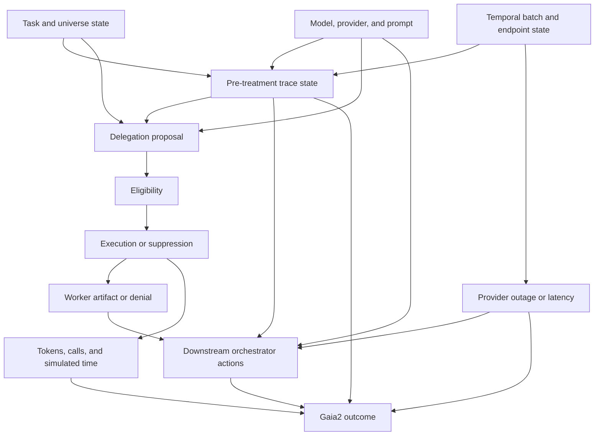

# Causal Analysis of Dynamic LLM-Agent Orchestration in Meta ARE and Gaia2

## Final Experimental Protocol, Implementation Specification, Causal Analysis Plan, and OpenRouter-Free Model Strategy

**Status:** Locked for implementation and pilot, subject only to the explicit pilot gates and amendment rules defined below  
**Protocol version:** `delegation-v1-openrouter-free`  
**Date:** July 23, 2026  
**Primary research program:** Causally grounded learning and reinforcement learning for dynamic LLM-agent orchestration  
**Initial paper scope:** The causal effect of model-proposed delegation, with verification as a separately isolated and pilot-gated secondary experiment  
**Environment:** Meta Agents Research Environments (ARE)  
**Benchmark:** A pinned revision of the Gaia2 validation dataset  
**Model policy:** Only exact zero-price text models exposed through OpenRouter may be used  
**Default primary-model candidate:** `openai/gpt-oss-20b:free`  
**Prespecified replication candidates:** `nvidia/nemotron-3-super-120b-a12b:free` and `google/gemma-4-26b-a4b-it:free`

---

# 1. Executive Decision

The first paper will answer one narrow, experimentally identifiable question:

> **When a dynamic LLM orchestrator proposes delegating a bounded subtask to a cognitive worker, what is the causal effect of allowing that exact delegation on task success, partial task completion, token usage, model-call usage, latency, and reliability?**

The study will use:

- native Meta ARE as the simulated environment and agent research runtime;
- Gaia2 as the dynamic task distribution and oracle-backed evaluator;
- a custom ARE `BaseAgent` implementation as the dynamic orchestration policy;
- a typed proposal-to-execution boundary that permits randomized intervention;
- one homogeneous, fresh, read-only cognitive worker;
- exact OpenRouter free-model slugs only;
- no local inference, paid models, paid fallback, generic model router, or silent provider substitution.

The preferred causal design is a **paired eligible-prefix intervention**:

1. Run the orchestrator naturally until it emits its first valid `DELEGATE` proposal.
2. Capture the complete pre-treatment state of the agent and simulated world.
3. Validate that the state can be restored without divergence.
4. Continue twice from the identical prefix:
   - **Treatment:** execute the exact proposed delegation.
   - **Control:** suppress the delegation and return a fixed denial response.
5. Run both continuations under the same downstream policy.
6. Compare the paired outcomes.

If exact state restoration cannot be validated, the prespecified fallback is a proposal-conditional randomized trial in which the intervention gate executes or suppresses the proposal with probability 0.5 after the proposal has been serialized and hashed.

The initial paper will **not** include Onyx or Slate as experimental conditions. It will not study persistent threads, thread reuse, forks, episode composition, skill chaining, parallel worker graphs, recursive delegation, worker memory, model routing, or learned stopping. These are separate causal questions and would introduce bundled treatments that obstruct interpretation.

The only architectural principle retained from programmable agent runtimes is the minimal requirement that a stochastic model emit a typed action which is then validated and executed through deterministic runtime semantics. This is experimental infrastructure, not an Onyx implementation and not a treatment.

---

# 2. Why This Is the Correct First Paper

The long-term research objective is broader:

> Build a trace-native dynamic multi-agent orchestration framework in which delegation, spawning, communication, context routing, verification, aggregation, model selection, memory, recovery, continuation, and stopping can be measured, causally analyzed, constrained, and eventually optimized through learned policies.

Attempting this entire program in one experiment would be scientifically weak.

## 2.1 Bundled architectures do not identify mechanisms

A comparison between a single agent and a Slate- or Onyx-inspired system would change many things simultaneously:

- worker persistence;
- context selection;
- context compression;
- worker count;
- parallelism;
- synchronization;
- skills;
- model allocation;
- memory;
- retry and recovery semantics.

A performance difference would not reveal which decision caused the change.

## 2.2 Repeated interventions create a sequential-causal problem

Intervening repeatedly within one trace creates:

- time-varying treatments;
- treatment-confounder feedback;
- action-dependent eligibility;
- treatment-dependent future state distributions;
- delayed outcomes;
- positivity problems in rarely visited states.

That setting may require dynamic treatment regimes, marginal structural models, g-computation, sequential doubly robust estimation, causal MDPs, or reinforcement-learning methods. These are appropriate later, but unnecessary for the first causal result.

## 2.3 Delegation is the foundational multi-agent action

Delegation initiates most multi-agent mechanisms:

- task decomposition;
- worker creation;
- context selection;
- evidence transfer;
- communication overhead;
- integration burden;
- correlated or independent failure;
- extra cost and delay.

If bounded delegation is not causally useful under any identifiable state, more complex multi-agent topologies are premature. If it is useful, its treatment-effect heterogeneity provides a grounded basis for later routing and RL policies.

---

# 3. Decision on Onyx and Slate

## 3.1 Final decision

**Onyx and Slate are excluded from Paper 1 as treatments, baselines, and claimed implementations.**

The experiment will not compare:

- Onyx-like execution versus plain ARE;
- Slate-style thread weaving versus a single agent;
- persistent versus fresh workers;
- thread versus fork execution;
- episode summaries versus full context;
- dynamic skills versus static tools;
- parallel versus sequential workers.

## 3.2 Why excluding them improves causal validity

Each feature is a separate causal question:

| Feature | Separate question |
|---|---|
| Persistent thread | Does reuse improve continuity or introduce stale-context contamination? |
| Episode summary | Does compression preserve decision-relevant evidence? |
| Thread versus fork | Does asynchronous or synchronous execution improve outcomes? |
| Dynamic skill exposure | Does adaptive capability activation improve routing? |
| Parallel workers | Does latency reduction outweigh duplication and merge errors? |
| Typed stream synchronization | Does explicit synchronization reduce integration failures? |
| Runtime recovery | Do retries and resumption causally improve task completion? |

Bundling these into one architecture condition would produce an uninterpretable average.

## 3.3 What is retained

Only the following fixed runtime boundary is retained:

```text
model emits proposed action
        ↓
schema validation
        ↓
eligibility determination
        ↓
concealed intervention
        ↓
deterministic treatment/control semantics
        ↓
trace and state transition
```

This boundary is necessary to intervene on an action after the model reveals its intended choice but before the choice alters the system.

## 3.4 Later architecture experiments

After Paper 1, separate studies can test:

1. fresh worker versus reusable thread;
2. full context versus selected context versus compressed episode;
3. synchronous fork versus asynchronous worker;
4. one worker versus several parallel workers;
5. static versus dynamically activated skills;
6. raw transcript versus typed artifact return;
7. alternative join and synchronization policies;
8. compilation of successful instruction sequences into reusable macros.

---

# 4. Research Questions

## 4.1 Primary research question

> Among pre-treatment states where the current orchestration policy proposes a valid bounded delegation, what is the causal effect of executing that exact delegation rather than suppressing it?

## 4.2 Secondary questions

1. Does the causal effect differ across Gaia2 capability groups?
2. Does delegation improve oracle-action completion even when binary task success is unchanged?
3. Does any success improvement justify the additional model calls, tokens, and simulated delay?
4. Which pre-treatment variables predict beneficial, neutral, or harmful delegation?
5. How different is the observational association between delegation and success from the randomized causal effect?
6. Does the effect replicate across distinct free OpenRouter model families and scales?
7. In a separately isolated experiment, what is the causal effect of model-proposed verification?

## 4.3 Questions explicitly deferred

Paper 1 will not claim to answer:

- the universal value of multi-agent systems;
- whether actions the policy never proposes would have helped;
- optimal worker count;
- optimal context-routing policy;
- optimal thread reuse;
- optimal parallelism;
- optimal stopping;
- whether trace features are valid RL rewards;
- whether the result generalizes to every agent domain.

---

# 5. Prespecified Hypotheses

## H1 — Delegation has a nonzero proposal-conditional causal effect

Executing a valid model-proposed delegation changes final Gaia2 success relative to suppressing that proposal.

This is two-sided. Delegation may be beneficial, neutral, or harmful.

## H2 — Delegation benefit is heterogeneous

Delegation is more likely to help when the pre-treatment state contains:

- unresolved information requirements;
- high ambiguity;
- cross-application evidence needs;
- several candidate entities or records;
- explicit uncertainty;
- a bounded and separable worker objective.

Delegation is more likely to harm when the task is:

- simple;
- nearly complete;
- tightly sequential;
- sensitive to delay;
- poorly decomposable;
- dependent on context omitted from the worker packet.

Moderator analyses are exploratory unless frozen after the pilot and before confirmatory outcomes are accessed.

## H3 — Observational delegation associations are confounded

Harder states are expected to trigger more delegation. Therefore, natural runs that propose delegation may have lower success than runs that do not, even if executing the delegation is causally beneficial.

## H4 — Delegation first affects information-state outcomes

Delegation may improve intermediate mechanisms such as unique evidence acquisition, contradiction detection, or intended-write correction before changing terminal success.

These are mechanism outcomes, not substitutes for the primary outcome.

## H5 — Model family and scale moderate orchestration value

The value of delegation may differ across free OpenRouter models. Stronger models may need less assistance, or they may formulate and integrate delegated work more effectively. No direction is prespecified.

---

# 6. Meta ARE and Gaia2 as the Experimental Substrate

## 6.1 Why native ARE

ARE supplies the components that should remain outside the paper's contribution:

- simulated world state;
- stateful applications;
- read and write tools;
- asynchronous environment events;
- simulated time;
- immutable event logs;
- scenario initialization;
- custom agent hooks;
- logging callbacks;
- offline judging;
- OpenAI-compatible model-provider integration.

The custom orchestrator should subclass ARE's `BaseAgent`. The environment event loop should remain intact. The orchestration policy belongs inside the agent loop, while the intervention gate belongs between parsed proposal and execution.

## 6.2 Why Gaia2

Gaia2 provides dynamic scenarios involving:

- execution of state-changing operations;
- search and synthesis;
- environmental adaptation;
- temporal constraints;
- ambiguity and clarification;
- optional Agent2Agent and Noise augmentations.

Its oracle action graph evaluates required writes and their dependencies, which is stronger than grading only final natural-language text.

## 6.3 Dataset-count inconsistency

The protocol must not assume the size of `gaia2-mini` from its name or a single documentation page.

Before sampling:

```text
1. Pin the exact Gaia2 dataset revision.
2. Download that revision.
3. Enumerate every configuration and split programmatically.
4. Record scenario IDs, universes, capabilities, and row counts.
5. Store the dataset revision and manifest checksum.
6. Generate pilot and confirmatory splits from the immutable manifest.
```

If the pinned mini split contains 160 scenarios, the expected distribution is 32 per capability. If it contains 200, the expected distribution is 40 per capability. Any other distribution must be documented.

## 6.4 Validation-data restriction

Gaia2 validation scenarios may be used for evaluation and causal experimentation, but they must not be used to train the later RL orchestration policy.

Later policy learning should use separately generated ARE scenarios and preserve Gaia2 as external evaluation.

---

# 7. Experimental Unit and Data Structure

## 7.1 Scenario

A scenario specifies:

- initial universe state;
- user task;
- scheduled or triggered events;
- available applications and tools;
- oracle write actions and dependencies.

## 7.2 Base run

A base run is one stochastic execution of the orchestrator until it either:

- completes without a valid delegation proposal; or
- reaches the first valid proposal and yields an eligible prefix.

## 7.3 Eligible prefix

An eligible prefix is the complete history immediately after a valid `DELEGATE` proposal is emitted and immediately before it is executed.

It contains:

- environment state;
- event queue;
- simulated time;
- application states;
- notifications;
- model-visible history;
- tool observations;
- proposed worker specification;
- model and provider metadata;
- pre-treatment state hashes.

## 7.4 Branch

A branch is one continuation from an eligible prefix:

- `T=1`: execute delegation;
- `T=0`: suppress delegation.

## 7.5 Statistical nesting

```text
scenario
  └── stochastic base run / eligible prefix
        ├── treatment continuation
        └── control continuation
```

Analysis must account for branch pairing and repeated prefixes within scenarios.

---

# 8. Agent Architecture

## 8.1 Main orchestrator

The orchestrator:

- receives the task;
- receives environment notifications;
- accesses permitted Gaia2 tools;
- owns all state-changing actions;
- proposes delegation when useful;
- selects the worker objective, context, and read-only tools;
- integrates any worker artifact;
- decides final writes, user messages, and stopping.

## 8.2 Cognitive worker

The worker is:

- a fresh model session;
- homogeneous with the orchestrator within each model condition;
- read-only;
- limited to one bounded objective;
- unable to send user-facing messages;
- unable to write to the environment;
- unable to spawn another worker;
- unable to invoke a verifier;
- unable to access hidden oracle information;
- terminated after one bounded episode.

The worker may:

- inspect read-only application state;
- search records;
- read email, files, messages, contacts, and calendars;
- analyze temporal relations;
- perform calculations;
- return a typed evidence artifact.

## 8.3 Worker artifact schema

```json
{
  "artifact_type": "EVIDENCE_REPORT",
  "objective": "string",
  "status": "COMPLETE | PARTIAL | BLOCKED",
  "findings": [
    {
      "claim": "string",
      "evidence_refs": ["event_or_tool_reference"],
      "confidence": "LOW | MEDIUM | HIGH"
    }
  ],
  "uncertainties": ["string"],
  "contradictions": ["string"],
  "recommended_next_action": "string or null"
}
```

Every material finding must cite an environment or tool reference. Unsupported content may appear only as uncertainty or hypothesis.

## 8.4 Primary topology

```text
Dynamic orchestrator
    ├── direct Gaia2 read/write tools
    ├── at most one fresh read-only worker
    ├── user communication
    ├── wait
    └── stop
```

No parallel workers, persistent workers, worker-to-worker communication, recursion, or heterogeneous models are allowed in the primary condition.

---

# 9. Typed Action Vocabulary

The orchestrator emits exactly one action per decision step:

```text
CALL_TOOL
DELEGATE
SEND_USER_MESSAGE
WAIT
STOP
```

`VERIFY` is enabled only in the separate verification experiment.

## 9.1 Delegation proposal schema

```json
{
  "action": "DELEGATE",
  "proposal_id": "uuid",
  "objective": "Determine which policy version governed the transaction date.",
  "reason_code": "TEMPORAL_DEPENDENCY_UNRESOLVED",
  "context_refs": [
    "task",
    "transaction_record",
    "notification_04"
  ],
  "allowed_read_tools": [
    "email.search",
    "files.read",
    "calendar.read"
  ],
  "expected_artifact": "EVIDENCE_REPORT",
  "completion_criterion": "Identify the active version and cite supporting records.",
  "max_worker_steps": 8,
  "max_worker_output_tokens": 2000
}
```

## 9.2 Controlled reason codes

```text
INFORMATION_GAP
CROSS_APPLICATION_SEARCH
TEMPORAL_DEPENDENCY_UNRESOLVED
AMBIGUITY_REQUIRES_INDEPENDENT_ANALYSIS
EVIDENCE_CONFLICT
HIGH_WRITE_RISK
CONTEXT_OVERLOAD
SPECIALIZED_CALCULATION
OTHER_BOUNDED_SUBTASK
```

These make traces analyzable without requiring hidden chain-of-thought.

---

# 10. Eligibility Rules

A proposal is eligible only if every rule passes before treatment information is revealed.

## 10.1 Validity rules

- The action parses under the exact schema.
- The objective is nonempty and bounded.
- The completion criterion is testable.
- Requested tools are on the read-only allowlist.
- The expected artifact is valid.
- Worker limits are within the fixed budget.

## 10.2 Experimental rules

- No worker has already been used.
- No earlier delegation has been executed or suppressed.
- The same objective is not already complete.
- The proposal occurs before terminal completion.
- The worker does not request oracle access.
- The worker does not request write authority.
- The scenario belongs to the prespecified analysis set.

## 10.3 Exclusion reasons

```text
INVALID_SCHEMA
UNBOUNDED_OBJECTIVE
WRITE_PERMISSION_REQUESTED
DUPLICATE_OBJECTIVE
WORKER_ALREADY_USED
ORACLE_LEAKAGE_RISK
POST_TERMINAL_PROPOSAL
BUDGET_EXCEEDED
UNSUPPORTED_TOOL
SCENARIO_OUT_OF_SCOPE
```

Invalid proposals are logged but not randomized.

---

# 11. Preferred Causal Design: Paired Eligible-Prefix Continuations

## 11.1 Rationale

Independent full runs differ before treatment. Pairing both treatments at the same eligible prefix removes pre-treatment trajectory variation.

```text
same scenario
same initial world
same pre-treatment events
same model-visible history
same proposed delegation
                    ↓
       ┌────────────┴────────────┐
       ↓                         ↓
execute delegation         suppress delegation
       ↓                         ↓
continue policy             continue policy
       ↓                         ↓
Y(1)                        Y(0)
```

## 11.2 Snapshot requirements

The snapshot must include or reconstruct:

- all application states;
- completed event log;
- future event queue;
- simulated clock;
- notification queue;
- agent-visible logs and messages;
- tool definitions;
- accumulated budgets;
- proposal object;
- prompts and schemas;
- model slug;
- provider slug;
- reasoning and sampling configuration;
- all harness-controlled random seeds.

## 11.3 Replay-validation gate

A prefix is valid only when restored state matches the original on:

```text
application-state hash
completed-event-log hash
future-event-queue hash
simulated timestamp
notification-queue hash
agent-history hash
proposal hash
tool-schema hash
prompt hash
model/provider configuration hash
```

If a hash differs:

- mark the prefix `REPLAY_INVALID`;
- exclude it from the paired primary analysis;
- optionally route it into the randomized fallback design;
- report replay-failure frequency and predictors.

## 11.4 Treatment branch

1. Execute the exact proposed worker specification.
2. Return the artifact or genuine worker failure through a fixed wrapper.
3. Disable further delegation.
4. Continue the orchestrator to completion.

## 11.5 Control branch

1. Do not create a worker.
2. Return the fixed denial response.
3. Disable further delegation.
4. Continue the orchestrator to completion.

```json
{
  "status": "DELEGATION_UNAVAILABLE",
  "reason": "EXPERIMENTAL_CONTROL"
}
```

The denial may not suggest a tool, strategy, or answer.

## 11.6 Branch order

Run both branches consecutively and randomize which executes first.

This controls for:

- endpoint congestion;
- rate-limit windows;
- provider load;
- time-varying serving behavior;
- transient availability.

Branch order is a nuisance randomization, not the treatment assignment.

## 11.7 Hosted-model stochasticity

OpenRouter-hosted models may not provide deterministic outputs even with a requested seed. Therefore:

- record requested seed when supported;
- record whether the provider accepted it;
- do not assume deterministic continuation;
- treat model sampling as part of the stochastic outcome;
- use repeated eligible prefixes;
- randomize branch order;
- keep treatment and control executions close in wall time.

## 11.8 Estimand represented by the pair

The paired design estimates the total effect of executing the exact delegation at the sampled proposal state under a fixed downstream policy. It includes downstream adaptations caused by the worker result.

It is not a controlled direct effect that removes mediation through later tool use or plan changes.

---

# 12. Fallback Design: Proposal-Conditional Randomized Trial

If exact state restoration is insufficient, use single-branch randomization.

## 12.1 Assignment

After a valid proposal and before execution:

```text
T ~ Bernoulli(0.5)
```

Use permuted blocks within:

- scenario;
- capability;
- model condition;
- run batch.

Store the assignment probability.

## 12.2 Concealment

The orchestrator must not know:

- assignment;
- treatment probability;
- block history;
- branch family;
- randomization seed.

Assignment is revealed only to the runtime after the proposal is serialized and hashed.

## 12.3 Intention-to-treat

Analyze by assigned execution policy.

If treatment produces a worker timeout, provider error after worker launch, malformed artifact, or context failure, that remains part of the treatment outcome unless the failure is demonstrated to be a pre-treatment infrastructure failure.

## 12.4 Compliance

Treatment is compliant when:

- `T=1` launches the exact proposed worker and returns its artifact or genuine failure;
- `T=0` launches no worker and returns the fixed denial.

Runtime override is a protocol violation.

---

# 13. Potential-Outcomes Framework

Let:

- `S` denote the pre-treatment orchestration state;
- `E=1` denote a valid proposal;
- `T∈{0,1}` denote suppression or execution;
- `Y(1)` denote the outcome under execution;
- `Y(0)` denote the outcome under suppression.

## 13.1 Primary estimand

```math
τ_proposal = E[Y(1) - Y(0) | E = 1]
```

This applies only to states reached by the current policy where the policy proposed a valid delegation.

## 13.2 Paired-prefix estimand

```math
τ_paired = E_{S ~ S_proposal}[Y_S(1) - Y_S(0)]
```

Both potential outcomes are approximated by independent continuations from the same verified prefix.

## 13.3 Policy-level estimand

A secondary deployment-level estimand compares the same policy with delegation globally enabled versus disabled:

```math
τ_policy = E[Y^{allow-policy} - Y^{deny-policy}]
```

This includes runs where delegation is never proposed and answers a product-level question rather than the mechanistic proposal-conditional question.

## 13.4 Conditional effects

Exploratory conditional treatment effects:

```math
τ(x) = E[Y(1) - Y(0) | X = x, E = 1]
```

`X` may contain only pre-treatment variables.

Candidate moderators:

- capability;
- trace depth;
- read-call count;
- prior tool errors;
- evidence count;
- explicit uncertainty;
- context length;
- pending events;
- simulated time;
- reason code;
- objective length;
- worker tool breadth;
- model family.

---

# 14. Causal Assumptions and Enforcement

## 14.1 Consistency

`T=1` and `T=0` must have stable meanings.

Enforcement:

- exact schemas;
- fixed worker wrapper;
- fixed denial;
- fixed worker budgets;
- no hidden worker creation;
- no treatment-dependent prompt changes beyond artifact versus denial;
- versioned runtime semantics.

## 14.2 Exchangeability

For the paired design, both branches share an identical verified prefix.

For the fallback design, treatment is randomized after proposal.

## 14.3 Positivity

Every eligible proposal must be able to receive either treatment.

Use 0.5 assignment unless a documented safety issue requires amendment before confirmatory data collection.

## 14.4 No anticipation

The model cannot know treatment before proposing.

Do not expose assignment probability, branch metadata, run family, or previous assignments.

## 14.5 No cross-run interference

Every run and branch uses:

- isolated ARE environment state;
- isolated queues;
- isolated conversation state;
- no shared worker memory;
- no cross-branch artifact cache;
- no external mutable memory accessible to the model.

Provider-side prompt caching may be used only if it is content-preserving and logged.

## 14.6 Replay equivalence

Paired causal interpretation requires matching pre-treatment states. Hash validation is mandatory.

## 14.7 Stable measurement

Freeze the Gaia2 judge, tool schemas, prompts, model slug, provider slug, and runtime during confirmatory runs.

---

# 15. Avoiding Common Causal Errors

## 15.1 Do not adjust for post-treatment mediators

The primary outcome model must not control for:

- worker artifact quality;
- post-worker tool calls;
- post-treatment trace length;
- whether the orchestrator cited the worker;
- later verification;
- final token use.

These may be caused by treatment. They can be analyzed as outcomes or mediators in explicitly exploratory analyses.

## 15.2 Do not exclude failed workers

A malformed, unhelpful, or failed worker is part of the real effect of allowing delegation.

## 15.3 Do not treat proposal versus no proposal as causal

Proposal states differ in difficulty. This comparison is observational and is included to demonstrate selection effects.

## 15.4 Do not reward trace length by assumption

Long traces may indicate difficult tasks. Short traces may indicate efficiency or premature termination. Trace statistics remain diagnostics until experimentally validated.

## 15.5 Do not leak the oracle

The Gaia2 oracle may appear only in post-run evaluation. It cannot enter model context, worker context, eligibility, runtime feedback, or treatment assignment.

## 15.6 Do not mix model or provider identities

A different model slug, provider, reasoning mode, endpoint, or fallback is a different model condition.

---

# 16. Outcomes

## 16.1 Primary outcome

**Binary Gaia2 scenario success** from the pinned oracle-backed judge.

## 16.2 Key secondary outcome

**Oracle completion fraction:**

```text
matched required oracle actions / total required oracle actions
```

This provides sensitivity when binary success is sparse.

## 16.3 Additional task outcomes

- required write completion;
- hard argument violations;
- soft equivalence failures;
- causal dependency violations;
- temporal violations;
- unauthorized writes;
- invalid tool calls;
- user-clarification correctness;
- final environment-state validity.

## 16.4 Resource outcomes

Because the study uses zero-price endpoints, monetary API cost is not the primary resource metric. Report:

- total model calls;
- input tokens;
- output tokens;
- reasoning tokens where exposed;
- worker tokens;
- read-tool calls;
- write-tool calls;
- simulated completion time;
- wall-clock time;
- provider retries;
- rate-limit waits;
- endpoint failures.

A free endpoint does not imply zero computational cost. The paper should describe the endpoints as zero-price to the experimenter, not costless.

## 16.5 Delegation-mechanism outcomes

- artifact schema validity;
- objective completion;
- unique evidence discovered;
- duplicate evidence;
- contradictions identified;
- output referenced by the orchestrator;
- planned write changed;
- invalid write prevented;
- valid write incorrectly prevented;
- error introduced;
- communication-token overhead.

## 16.6 Reliability outcomes

Across repeated runs:

- pass@k;
- pass^k;
- success variance;
- oracle-completion variance;
- write-action agreement;
- proposal-rate variance;
- stopping-point variance;
- trace-length variance;
- provider-failure variance.

---

# 17. Scenario Split

## 17.1 Split algorithm

After pinning the dataset:

1. Stratify by capability.
2. Stratify by universe where possible.
3. Generate a deterministic split from a recorded seed.
4. Reserve 25% of each capability for development and pilot.
5. Keep confirmatory outcomes inaccessible until prompts, eligibility, model condition, and analysis are frozen.

## 17.2 If mini has 160 scenarios

```text
Pilot:         8 × 5 capabilities = 40
Confirmatory: 24 × 4 non-Time capabilities = 96
Time reserve: 24
```

## 17.3 If mini has 200 scenarios

```text
Pilot:        10 × 5 capabilities = 50
Confirmatory: 30 × 4 non-Time capabilities = 120
Time reserve: 30
```

## 17.4 Why Time is not primary

Time scenarios can make treatment effects depend on:

- provider queueing;
- free-tier rate limits;
- generation duration;
- retry behavior;
- simulated-time configuration.

Time is therefore reserved for a later robustness analysis under controlled fixed and measured timing policies.

## 17.5 Why Agent2Agent and Noise are deferred

Agent2Agent introduces application-agent communication. Noise changes tool and environment reliability. Both introduce new mechanisms and are later generalization settings.

---

# 18. OpenRouter-Free-Only Model Policy

## 18.1 Hard rule

Every orchestrator, worker, verifier, judge model outside Gaia2's deterministic oracle, and model-based auxiliary component must use an exact OpenRouter model slug whose input and output price are both zero at the start of its experimental batch.

The study will not use:

- local models;
- paid OpenRouter endpoints;
- provider BYOK endpoints that incur external charges;
- paid fallbacks;
- `openrouter/free`;
- automatic model substitution;
- mixed paid/free execution within a model condition.

## 18.2 Why the generic free router is prohibited

`openrouter/free` may choose different models across requests. This would make model identity a hidden time-varying variable and invalidate a controlled model condition.

Use exact slugs only.

## 18.3 Current prespecified candidate pool

The following exact free models form the initial candidate pool:

| Role | Exact slug | Rationale |
|---|---|---|
| Default primary candidate | `openai/gpt-oss-20b:free` | Structured outputs, tool use, configurable reasoning, moderate scale, 131K context |
| Strong replication or replacement | `nvidia/nemotron-3-super-120b-a12b:free` | Larger orchestration-oriented MoE, multi-agent training emphasis, very long context |
| Cross-family replication | `google/gemma-4-26b-a4b-it:free` | Distinct model family, instruction following, function calling, long context |

The exact roster is a snapshot, not a guarantee of future availability.

## 18.4 No treatment-effect-based model selection

The primary model must not be selected because it shows the largest delegation benefit in pilot data.

Model qualification uses only:

- endpoint availability;
- provider-pinning support;
- request completion;
- schema validity;
- tool-use validity;
- worker artifact validity;
- baseline task-success range;
- proposal frequency;
- replay compatibility;
- operational stability.

Treatment-control outcome differences must remain blinded during model qualification.

## 18.5 Default selection rule

`openai/gpt-oss-20b:free` becomes the primary model if it passes every hard gate.

If it fails a hard gate, evaluate candidates in this fixed order:

1. `nvidia/nemotron-3-super-120b-a12b:free`;
2. `google/gemma-4-26b-a4b-it:free`.

The first candidate passing all gates becomes primary. This decision must be recorded before confirmatory outcomes are accessed.

## 18.6 Replication rule

At least one model from a different family must replicate the strongest prespecified finding on a stratified subset.

Preferred replication order:

1. Nemotron 3 Super if gpt-oss is primary;
2. Gemma 4 if Nemotron is primary;
3. gpt-oss if Gemma is primary.

---

# 19. Free-Model Availability Snapshot and Manifest

## 19.1 Snapshot timing

Immediately before each model-qualification or confirmatory batch:

1. query OpenRouter's models endpoint;
2. filter for text-output models with zero input and output price;
3. save the raw response;
4. save a normalized manifest;
5. query provider availability for the exact selected model;
6. record context, supported parameters, and provider policies;
7. hash the manifest.

## 19.2 Required manifest fields

```text
snapshot_timestamp_utc
requested_model_slug
canonical_model_slug
model_created_at
context_length
input_price
output_price
supported_parameters
available_provider_slugs
selected_provider_slug
provider_context_length
provider_max_output
provider_quantization_if_exposed
provider_data_policy
provider_uptime_snapshot
manifest_sha256
```

## 19.3 Confirmatory lock

Before confirmatory runs, freeze:

- exact model slug;
- exact provider slug;
- reasoning mode;
- sampling parameters;
- context limit;
- output limit;
- response-format strategy;
- prompt hashes;
- tool-schema hashes.

A provider or model change creates a new experimental condition.

---

# 20. Provider Pinning and Routing Controls

## 20.1 No provider fallback

Every request must disable fallback.

Representative routing configuration:

```json
{
  "provider": {
    "only": ["PINNED_PROVIDER_SLUG"],
    "allow_fallbacks": false,
    "require_parameters": true
  }
}
```

The exact syntax must be validated against the current OpenRouter API before data collection.

## 20.2 Record actual routing

For every response store:

- requested model;
- returned model;
- selected provider;
- request ID;
- response ID;
- latency;
- usage fields;
- reasoning-token fields if present;
- error category;
- retry count.

Reject and flag any response whose returned identity does not match the locked condition.

## 20.3 Endpoint health gate

Before starting a treatment-control pair:

1. send a low-token health request using the same model and provider;
2. verify successful response and identity;
3. verify required parameters are accepted;
4. begin the pair within a fixed short interval.

Health checks are not included in task outcomes but are logged as infrastructure events.

---

# 21. Free-Tier Rate Limits, Outages, and Temporal Drift

Free endpoints introduce operational constraints that must be handled explicitly.

## 21.1 Rate-limit handling

- Respect provider and OpenRouter rate limits.
- Use bounded exponential backoff with jitter.
- Do not rotate accounts or keys to evade limits.
- Run treatment and control branches consecutively when possible.
- Randomize branch order.
- Record wait duration and rate-limit headers where exposed.

## 21.2 Pre-treatment outage

If the endpoint is unavailable before an eligible proposal or before either branch begins, classify the attempt as pre-treatment infrastructure failure and rerun later under the same run lineage.

## 21.3 One-branch outage

If one branch fails because the provider becomes unavailable after the other branch has run:

- preserve both attempt records;
- do not switch provider;
- do not analyze the incomplete pair as complete;
- rerun the entire pair from the same validated prefix under a new attempt ID;
- include sensitivity analyses counting the unavailable branch as failure and as missing.

## 21.4 Mid-study endpoint disappearance

If a free model or pinned provider disappears during confirmatory collection:

1. freeze the completed dataset;
2. do not substitute another model inside the condition;
3. assess whether the preregistered minimum sample has been reached;
4. if yes, close the condition and report early infrastructure termination;
5. if no, issue a protocol amendment and begin a new model condition from the start.

Do not pool substituted-model runs with the original condition.

## 21.5 Temporal blocks

Record batch date and time. Randomize scenario order within temporal blocks. Include batch as a nuisance factor or sensitivity variable, not as a post hoc treatment modifier unless preregistered.

---

# 22. Reasoning and Sampling Configuration

## 22.1 General rule

Use one fixed configuration per model condition.

Freeze:

- temperature;
- top-p;
- top-k where supported;
- repetition penalty where supported;
- reasoning effort or reasoning token cap;
- maximum completion tokens;
- stop sequences;
- response format;
- tool-choice policy.

## 22.2 Default primary configuration

For `openai/gpt-oss-20b:free`, begin qualification with:

```text
reasoning effort: medium
temperature: 0.2
top_p: 0.9
max output: fixed by role
structured output: strict JSON schema where supported
```

These are qualification defaults, not immutable truths. They may be adjusted during pilot for schema reliability, but must be frozen before confirmatory work.

## 22.3 Reasoning continuity

If a model requires provider-specific reasoning-state fields to continue a conversation, preserve them exactly as required by the API. Log whether hidden or visible reasoning data is returned.

Do not publish private chain-of-thought. Store structured actions, final visible responses, usage metadata, and short reason codes.

## 22.4 Homogeneous model condition

Within a model condition:

```text
orchestrator model = worker model
provider = same provider
reasoning mode = same mode
sampling configuration = same configuration
```

Prompts and tool permissions differ by role; the underlying model condition does not.

---

# 23. Model Qualification Gates

A candidate enters confirmatory runs only if it passes all hard gates.

| Gate | Threshold |
|---|---:|
| Exact free endpoint remains available through qualification | Required |
| Exact provider can be pinned with fallback disabled | Required |
| Successful request completion | ≥95% excluding declared service outages |
| Valid top-level action JSON after one repair | ≥97% |
| Valid delegation schema | ≥95% |
| Valid worker artifact | ≥95% |
| Valid tool name and arguments | ≥95% |
| Unauthorized worker writes | 0 |
| Hidden-oracle leakage | 0 |
| Context overflow | <5% |
| Non-Time baseline success | approximately 8%–80% |
| Eligible delegation proposal rate | preferably 20%–70% |
| Replay validation | ≥95% for paired design |

## 23.1 Floor and ceiling gates

If baseline success is below approximately 8%, binary outcomes may exhibit a floor effect. If above approximately 80%, they may exhibit a ceiling effect.

A model outside this range may still be used in exploratory analysis, but should not automatically become the primary condition.

## 23.2 Proposal-rate gate

Very low proposal frequency can make proposal-conditional estimation infeasible. Very high proposal frequency may indicate prompt-induced overdelegation.

The prompt may be repaired during pilot only if the issue is clearly a schema or policy failure. The experiment must not prompt the model to delegate merely to manufacture eligibility.

## 23.3 Treatment blinding during qualification

Qualification reports must hide paired treatment-control outcome differences. Selection uses operational and baseline gates only.

---

# 24. Prompt and Policy Freezing

Before confirmatory runs, freeze and hash:

- orchestrator prompt;
- worker prompt;
- tool descriptions;
- action schemas;
- artifact schema;
- eligibility rules;
- denial response;
- sampling and reasoning settings;
- context-construction algorithm;
- truncation policy;
- maximum steps;
- token budgets;
- simulated-time policy;
- randomization code;
- model and provider manifests;
- judge configuration;
- analysis scripts.

Any change after pilot requires a protocol amendment before confirmatory outcomes are inspected.

---

# 25. Simulated Time and Wall Time

## 25.1 Primary simulated-time policy

Use fixed model-call durations so provider latency does not become a causal component of the primary outcome.

Initial fixed policy:

```text
orchestrator call: 5 simulated seconds
worker call:       5 simulated seconds
```

Gaia2 tool actions retain scenario-defined timing.

## 25.2 Wall time

Record wall time as an operational endpoint. It includes free-tier queueing and rate-limit effects and must not be confused with simulated environment time.

## 25.3 Time robustness

After the main result, rerun the strongest finding on reserved Time scenarios under:

1. fixed generation duration;
2. measured generation duration;
3. optionally capped measured duration.

---

# 26. Sample Size and Power

## 26.1 Why benchmark count is insufficient

Power depends on:

- baseline success;
- proposal frequency;
- eligibility rate;
- replay-validity rate;
- paired discordance;
- scenario clustering;
- provider attrition;
- treatment effect.

The pilot must estimate these.

## 26.2 Pilot runs

Use three stochastic base runs per pilot scenario.

If mini has 160 scenarios:

```text
40 pilot scenarios × 3 = 120 base runs
```

If mini has 200 scenarios:

```text
50 pilot scenarios × 3 = 150 base runs
```

Estimate:

- proposal and eligibility rate;
- replay validity;
- binary success;
- oracle-completion variance;
- paired discordance;
- suffix token use;
- provider failure;
- pair completion rate.

## 26.3 Confirmatory schedule

Start with six base seeds per confirmatory scenario.

For 160 mini scenarios:

```text
96 scenarios × 6 = 576 base runs
```

For 200 mini scenarios:

```text
120 scenarios × 6 = 720 base runs
```

Extend to eight seeds only if the prespecified eligible-prefix target has not been reached.

## 26.4 Eligible-prefix target

```text
minimum analyzable pairs: 200
desired pairs:            300
hard cap:                 400
```

Final power must be simulated using pilot estimates.

## 26.5 Paired binary power

Power depends on discordant pairs:

- treatment succeeds, control fails;
- treatment fails, control succeeds.

Use pilot frequencies to simulate McNemar/randomization-test power and minimum detectable risk differences.

## 26.6 Free-tier feasibility gate

Before confirmation, estimate expected API requests and compare with observed rate limits. The scientific sample target may not be silently reduced because of endpoint inconvenience.

If the desired sample is infeasible under the locked endpoint:

- extend the collection calendar;
- reduce nonessential exploratory runs;
- or amend the primary model before confirmation.

Do not weaken the causal design by mixing models within pairs.

---

# 27. Experimental Phases

## Phase 0 — Version locking

Record:

- ARE commit;
- package lock;
- Gaia2 revision;
- scenario manifest;
- split seed;
- OpenRouter model manifest;
- model and provider slugs;
- prompts and schemas;
- judge configuration;
- randomization seed commitment.

## Phase 1 — Infrastructure smoke test

Use 20 scenarios, four per capability, one run each.

Validate:

- environment reset;
- OpenRouter endpoint;
- exact identity return;
- provider pinning;
- structured actions;
- tool use;
- worker permissions;
- trace export;
- oracle scoring;
- simulated time;
- snapshot and replay;
- intervention gate.

No scientific conclusions.

## Phase 2 — Model qualification

Evaluate candidate models in the prespecified order using the pilot split and blinded treatment effects.

Select the primary model by the hard-gate rule.

## Phase 3 — Pilot

Use the reserved pilot split and three base runs per scenario.

Allowed changes:

- schema repairs;
- prompt repairs for invalid behavior;
- provider configuration repairs;
- eligibility-frequency estimation;
- replay debugging;
- power simulation;
- failure-taxonomy construction.

Pilot outcomes are not confirmatory evidence.

## Phase 4 — Confirmatory delegation study

For each base run:

1. execute the natural policy;
2. capture the first valid proposal;
3. validate eligibility;
4. snapshot and replay-validate;
5. health-check the locked endpoint;
6. run paired branches in randomized order;
7. use randomized fallback when prespecified;
8. judge outcomes;
9. append immutable records.

## Phase 5 — Cross-model replication

Use at least 48 stratified scenarios and three base seeds with the prespecified free replication model.

The replication tests direction and approximate magnitude, not exact equality.

## Phase 6 — Verification intervention

Run only if the pilot gate passes. Delegation is disabled in this phase.

## Phase 7 — Time, Noise, and Agent2Agent robustness

Apply only the strongest preregistered delegation finding to reserved or augmented settings.

---

# 28. Statistical Analysis Plan

## 28.1 Primary paired analysis

For binary success:

- paired 2×2 outcome table;
- treatment-only wins;
- control-only wins;
- exact or asymptotic McNemar test;
- paired absolute risk difference;
- scenario-clustered bootstrap confidence interval;
- supporting conditional or mixed-effects logistic model.

For oracle-completion fraction:

- within-prefix difference;
- mean and median paired difference;
- scenario-clustered bootstrap;
- robust mixed model as sensitivity analysis.

## 28.2 Randomized fallback analysis

For unpaired randomized prefixes:

- intention-to-treat difference;
- logistic mixed model or GEE for success;
- scenario-clustered standard errors;
- randomization inference from stored assignments.

Do not pool paired and unpaired estimates without a prespecified method.

Report:

1. paired estimate;
2. fallback randomized estimate;
3. combined sensitivity model with design indicator and interaction.

## 28.3 Observational-versus-causal analysis

Produce three estimates.

### Naive observational association

Compare runs that naturally propose delegation with those that do not.

### Adjusted observational estimate

Use pre-treatment covariates with cross-fitted AIPW or another doubly robust method.

Candidate covariates:

- capability;
- scenario and universe;
- trace depth;
- tokens before proposal;
- prior tool calls;
- prior errors;
- pending events;
- context size;
- reason code;
- current progress proxy;
- simulated time;
- model condition;
- temporal batch.

### Randomized causal estimate

Use treatment-control outcomes after proposal.

The discrepancy between observational and randomized estimates is a central result.

## 28.4 Heterogeneity

Explore effects by:

- capability;
- reason code;
- trace depth;
- evidence gap;
- context length;
- pending events;
- progress proxy;
- model family;
- temporal batch.

Use hierarchical shrinkage. Avoid many independent uncorrected subgroup tests.

Causal forests may generate hypotheses only unless a distinct holdout is preserved.

## 28.5 Resource trade-offs

Report jointly:

```text
Δ success
Δ oracle completion
Δ input tokens
Δ output tokens
Δ reasoning tokens
Δ calls
Δ simulated time
Δ wall time
```

Do not collapse these into one arbitrary score as the primary analysis.

## 28.6 Multiple-testing hierarchy

Confirmatory order:

1. delegation effect on binary success;
2. delegation effect on oracle completion;
3. delegation effect on total tokens/calls;
4. verification effect only if its gate was preregistered and passed.

All model interactions, capability effects, and mechanism analyses are secondary unless explicitly preregistered.

## 28.7 Reporting

Always report:

- absolute percentage-point effect;
- relative effect where useful;
- 95% confidence interval;
- raw counts;
- scenarios;
- eligible prefixes;
- replay validity;
- endpoint attrition;
- protocol violations.

---

# 29. Missingness, Failures, and Attrition

## 29.1 Pre-treatment infrastructure failure

Examples:

- ARE initialization failure;
- dataset corruption;
- endpoint unavailable before proposal;
- logger failure before treatment;
- identity mismatch during health check.

These attempts may be rerun under the same lineage and are not treatment outcomes.

## 29.2 Post-treatment failure

Examples:

- worker timeout;
- malformed worker artifact;
- context overflow caused by worker execution;
- treatment suffix provider failure after a successful worker request;
- orchestrator failure after worker return.

These remain treatment outcomes unless a prespecified provider-outage rule requires full-pair retry. Preserve original attempts for sensitivity analysis.

## 29.3 Replay failure

Replay-invalid prefixes are excluded from paired estimation but may enter randomized fallback analysis if assignment remains valid.

## 29.4 Attrition flow

Publish a CONSORT-style flow:

```text
base runs started
runs initialized
runs with proposals
valid proposals
snapshot attempts
replay-valid prefixes
endpoint health checks
paired branches started
paired branches completed
paired branches judged
fallback randomized prefixes
provider outages
identity mismatches
protocol violations
final analysis sample
```

---

# 30. Balance and Integrity Diagnostics

Before outcome analysis verify:

- 50/50 fallback assignment within blocks;
- no assignment prediction from pre-treatment state;
- randomized branch order;
- matching pre-treatment hashes;
- identical prompts and tools;
- same model and provider identity;
- no worker writes;
- no oracle leakage;
- no paid or alternate fallback;
- stable judge;
- stable budgets;
- no systematic replay or endpoint failures by capability.

Any failure requires amendment or sensitivity analysis.

---

# 31. Trace Schema

## 31.1 Event types

```text
RUN_STARTED
SCENARIO_INITIALIZED
OPENROUTER_MANIFEST_SNAPSHOT
ENDPOINT_HEALTH_CHECK
MODEL_REQUEST
MODEL_RESPONSE
ORCHESTRATOR_PROPOSAL
PROPOSAL_VALIDATION
INTERVENTION_ELIGIBILITY
PREFIX_SNAPSHOT
PREFIX_REPLAY_VALIDATION
BRANCH_ORDER_ASSIGNMENT
DELEGATION_EXECUTED
DELEGATION_SUPPRESSED
WORKER_STARTED
WORKER_TOOL_CALL
WORKER_TOOL_RESULT
WORKER_ARTIFACT
ORCHESTRATOR_RESUMED
ENVIRONMENT_TOOL_CALL
ENVIRONMENT_TOOL_RESULT
USER_MESSAGE
ENVIRONMENT_NOTIFICATION
PROVIDER_RATE_LIMIT
PROVIDER_OUTAGE
MODEL_IDENTITY_MISMATCH
FINAL_STOP
JUDGE_RESULT
RUN_FAILED
RUN_COMPLETED
```

## 31.2 Common fields

```text
schema_version
experiment_version
scenario_id
universe_id
capability
run_id
attempt_id
prefix_id
branch_id
event_id
causal_parent_ids
actor_id
actor_role
simulated_timestamp
wall_timestamp
requested_model_slug
returned_model_slug
selected_provider_slug
openrouter_request_id
reasoning_configuration
sampling_configuration
prompt_hash
tool_schema_hash
state_before_hash
state_after_hash
proposed_action
executed_action
eligibility
eligibility_reason
treatment
assignment_probability
branch_order
context_refs
artifact_refs
tool_refs
input_tokens
output_tokens
reasoning_tokens
wall_latency
simulated_duration
retry_count
rate_limit_wait
error_type
protocol_violation
```

## 31.3 Intervention record

```json
{
  "experiment_version": "delegation-v1-openrouter-free",
  "scenario_id": "...",
  "run_id": "...",
  "prefix_id": "...",
  "proposal_id": "...",
  "proposal_hash": "...",
  "eligibility": true,
  "state_hash": "...",
  "replay_valid": true,
  "design": "PAIRED_PREFIX",
  "branch_order": ["CONTROL", "TREATMENT"],
  "model_slug": "openai/gpt-oss-20b:free",
  "provider_slug": "...",
  "manifest_hash": "...",
  "treatment_semantics_version": "delegate-v1",
  "control_semantics_version": "deny-v1"
}
```

## 31.4 Storage layout

```text
runs/<run_id>/are_trace.json
runs/<run_id>/orchestration_trace.jsonl
runs/<run_id>/manifest.json
runs/<run_id>/judge.json
prefixes/<prefix_id>/snapshot_manifest.json
prefixes/<prefix_id>/treatment/
prefixes/<prefix_id>/control/
models/openrouter/<snapshot_timestamp>.json
data/runs.parquet
data/events.parquet
data/prefixes.parquet
data/interventions.parquet
data/artifacts.parquet
data/judgments.parquet
analysis/preregistered/
analysis/exploratory/
```

---

# 32. Runtime Invariants

The runtime must enforce:

- only the orchestrator can write to the environment;
- worker tools are read-only by construction;
- one worker maximum;
- no recursion;
- no oracle access;
- treatment cannot be overridden;
- invalid actions cannot mutate state;
- every write has actor and causal-parent IDs;
- every paired branch starts from a validated prefix;
- no cross-branch memory;
- exact model and provider identity;
- no fallback;
- no paid endpoint;
- all errors and retries are logged.

An invariant failure is a protocol violation, not a normal model error.

---

# 33. Verification Experiment

Verification is separate from delegation.

## 33.1 Question

> When the orchestrator proposes verifying a concrete candidate plan or answer, what is the causal effect of executing verification rather than suppressing it?

## 33.2 Topology

Delegation is disabled in verification runs.

## 33.3 Eligibility

- concrete candidate exists;
- explicit `VERIFY` proposal;
- evidence references exist;
- no previous verifier;
- verifier is read-only;
- candidate has not been submitted.

## 33.4 Treatment

```text
T=1: run one fresh verifier using the same exact free model/provider condition
T=0: return VERIFICATION_UNAVAILABLE
```

## 33.5 Outcomes

- final success;
- oracle completion;
- true correction;
- false correction;
- correct confirmation;
- incorrect confirmation;
- candidate flip;
- extra tokens, calls, and time.

## 33.6 Pilot gate

Verification becomes confirmatory only if:

- valid proposal rate is approximately 25% or higher;
- candidate errors are common enough to permit correction;
- verifier schema validity is at least 95%;
- oracle leakage is zero;
- false corrections are measurable.

---

# 34. Baselines

## 34.1 Stock ARE ReAct baseline

Run the stock ARE agent using the same locked free model/provider on the pilot and a smaller confirmatory subset.

Purpose:

- contextualize task difficulty;
- verify the custom schema does not catastrophically damage performance;
- provide a conventional single-agent reference.

It is not the causal control.

## 34.2 Delegation-disabled policy

Run the same dynamic orchestrator with delegation unavailable from the beginning on a subset.

Purpose:

- estimate deployment-level policy effect;
- compare policy-level and proposal-conditional effects.

## 34.3 No Onyx baseline

There is no Onyx or Slate baseline in Paper 1.

---

# 35. Robustness and Sensitivity Analyses

## 35.1 Replay sensitivity

Compare:

- paired replay-valid estimate;
- randomized fallback estimate;
- conservative bounds for replay-invalid prefixes.

## 35.2 Provider-failure sensitivity

Analyze provider failures as:

1. missing infrastructure events;
2. task failures;
3. successful full-pair reruns.

## 35.3 Judge sensitivity

Compare:

- deterministic hard checks;
- full hard plus soft judge;
- manual audit subset.

## 35.4 Context sensitivity

Rerun a subset at one lower context cap.

## 35.5 Model sensitivity

Replicate with a distinct free model family.

## 35.6 Provider sensitivity

Only if more than one zero-price provider serves the same exact model and both can be pinned, run a small exploratory provider replication. Do not mix providers within the primary condition.

## 35.7 Time sensitivity

Use fixed versus measured simulated generation time on reserved Time scenarios.

## 35.8 Capability sensitivity

Use hierarchical effects without treating every capability as an independent confirmatory test.

---

# 36. Manual Audit

Audit at least 10% of eligible prefixes, stratified by:

- treatment-only success;
- control-only success;
- both success;
- both failure;
- worker artifact failure;
- large token increase;
- treatment-induced write change;
- provider error;
- soft-judge-only decision;
- replay edge case.

Reviewers label:

- whether the objective was bounded;
- whether context was sufficient;
- whether unique evidence was added;
- whether integration was correct;
- whether a consequential action changed;
- whether judging was correct;
- whether a protocol violation occurred.

Reviewers should be blind to preferred hypotheses where practical.

---

# 37. Reproducibility Package

Release or preserve:

- ARE extension code;
- exact commits;
- package lock;
- prompts;
- schemas;
- randomization code;
- dataset manifest;
- trace schemas;
- analysis scripts;
- power simulations;
- OpenRouter model/provider manifests;
- endpoint configuration;
- preregistration and amendments;
- audit rubric;
- failure taxonomy;
- synthetic or redistributable traces where permitted.

Because free endpoint availability is unstable, reproducibility must distinguish:

1. **code and protocol reproducibility**;
2. **exact endpoint reproducibility**;
3. **model-family replication**.

If a free endpoint later disappears, the original manifest remains part of the experimental record even if exact reruns become impossible.

---

# 38. Preregistration Checklist

Before confirmatory collection, preregister:

- primary question;
- estimand;
- treatment and control semantics;
- paired and fallback designs;
- dataset revision and split;
- exact model and provider;
- free-model manifest hash;
- reasoning and sampling settings;
- prompt hashes;
- eligibility;
- outcomes;
- sample-size rule;
- stopping rule;
- exclusion and attrition rules;
- provider-outage rules;
- statistical models;
- multiplicity hierarchy;
- moderator list;
- audit sample;
- robustness analyses;
- verification launch criteria.

Publish amendments before viewing confirmatory treatment effects.

---

# 39. Contribution Claims

Paper 1 may claim:

1. a proposal-to-execution intervention method for dynamic LLM orchestration;
2. a paired eligible-prefix design using replayable agent-environment traces;
3. a typed orchestration trace schema in ARE;
4. the causal effect of executing model-proposed delegation on Gaia2;
5. a comparison between observational and randomized estimates;
6. conditional evidence about beneficial and harmful delegation states;
7. replication across zero-price OpenRouter model families;
8. a resource-accessible causal protocol that does not require paid frontier APIs or local accelerator clusters.

It may not claim:

- universal multi-agent superiority;
- effects of unproposed actions;
- causal effects of threads, forks, skills, memory, or parallelism;
- that Onyx or Slate succeeds or fails;
- exact generalization beyond Gaia2;
- that free endpoints are stable or costless;
- that trace features are ready-made RL rewards.

---

# 40. Relation to Partial Structure Discovery and Causal Bandits

The current experiment does not apply a causal-bandit algorithm. It supplies the interventional data and typed state required for later work.

A later research question is:

> What is the smallest reward-relevant causal structure that preserves every plausibly optimal orchestration action?

The long-term analogy is:

- context/state variables correspond to observed causal variables;
- orchestration actions correspond to interventions;
- success and resource outcomes correspond to reward;
- partial reward-relevant structure may reduce the action set that must be explored.

However, dynamic orchestration is sequential, stateful, and action-dependent. It is closer to a contextual causal bandit, dynamic treatment regime, or causal MDP than a static causal bandit.

Paper 1 therefore uses direct randomization rather than assuming that a static partial-structure theorem transfers unchanged.

To support later partial-structure work, log:

- all pre-treatment candidate state variables;
- available actions;
- proposed action;
- assignment probability;
- executed action;
- causal-parent event links;
- environment events;
- evidence coverage;
- disagreement;
- prior failures;
- accumulated tokens and calls;
- terminal outcomes.

Clearly label variables as:

- pre-treatment;
- post-treatment mediators;
- terminal outcomes;
- unavailable or latent.

---

# 41. Connection to Later RL

Paper 1 produces:

- a typed state representation;
- an action boundary;
- causal effects;
- treatment-effect moderators;
- harmful-action examples;
- resource trade-offs;
- candidate hard constraints.

A later policy state may include:

```text
capability
trace depth
progress estimate
evidence coverage
unresolved information gaps
pending events
tokens and calls so far
context length
prior errors
uncertainty
delegation history
```

Later actions may include:

```text
act directly
delegate
verify
request clarification
wait
continue
stop
```

The reward should begin with task success and explicit resource penalties. Trace-based shaping should be added only when supported by causal evidence.

Gaia2 validation scenarios must not be used for RL training.

---

# 42. Suggested Repository Layout

```text
causal-orch/
├── gaia2_are_causal_orchestration_experiment_protocol.md
├── pyproject.toml
├── configs/
│   ├── experiment.yaml
│   ├── models.yaml
│   ├── providers.yaml
│   ├── randomization.yaml
│   └── gaia2_manifest.json
├── src/
│   ├── agent/
│   │   ├── orchestrator.py
│   │   ├── worker.py
│   │   ├── prompts.py
│   │   └── schemas.py
│   ├── runtime/
│   │   ├── action_executor.py
│   │   ├── eligibility.py
│   │   ├── intervention_gate.py
│   │   ├── snapshot.py
│   │   ├── replay.py
│   │   ├── permissions.py
│   │   └── budgets.py
│   ├── tracing/
│   │   ├── events.py
│   │   ├── exporter.py
│   │   ├── hashes.py
│   │   └── parquet.py
│   ├── models/
│   │   ├── openrouter_client.py
│   │   ├── provider_lock.py
│   │   ├── health.py
│   │   └── manifests.py
│   ├── evaluation/
│   │   ├── gaia2_judge.py
│   │   ├── partial_oracle.py
│   │   └── manual_audit.py
│   └── analysis/
│       ├── flow.py
│       ├── paired.py
│       ├── randomized.py
│       ├── observational.py
│       ├── heterogeneity.py
│       └── power.py
├── scripts/
│   ├── pin_dataset.py
│   ├── snapshot_openrouter_models.py
│   ├── qualify_models.py
│   ├── build_split.py
│   ├── smoke_test.py
│   ├── run_pilot.py
│   ├── run_confirmatory.py
│   └── verify_reproducibility.py
├── tests/
└── docs/
    ├── preregistration.md
    └── data_dictionary.md
```

---

# 43. Intervention Pseudocode

```python
proposal = orchestrator.propose_action(state)
trace.log_proposal(proposal, state_hash=hash_state(state))

if proposal.action != "DELEGATE":
    return runtime.execute_normal(proposal)

eligibility = validate_delegation(proposal, state)
trace.log_eligibility(eligibility)

if not eligibility.valid:
    return runtime.return_invalid_action(eligibility.reason)

prefix = snapshot_full_prefix(environment, orchestrator, proposal)
validation = replay_and_compare(prefix)

if validation.valid:
    assert endpoint_health_check(locked_model, locked_provider)
    order = randomize_branch_order()
    results = {}

    for branch in order:
        clone = restore_prefix(prefix)

        if branch == "TREATMENT":
            worker_result = execute_worker(
                proposal.worker_spec,
                clone,
                model=locked_model,
                provider=locked_provider,
            )
            results[branch] = continue_orchestrator(clone, worker_result)
        else:
            results[branch] = continue_orchestrator(
                clone,
                fixed_delegation_denial(),
            )

    return results

assignment = concealed_random_assignment(probability=0.5)

if assignment == "TREATMENT":
    worker_result = execute_worker(
        proposal.worker_spec,
        environment,
        model=locked_model,
        provider=locked_provider,
    )
    return continue_orchestrator(environment, worker_result)

return continue_orchestrator(
    environment,
    fixed_delegation_denial(),
)
```

---

# 44. Exact Initial Execution Plan

## Step 1 — Pin ARE and Gaia2

- clone ARE;
- record commit;
- lock dependencies;
- download Gaia2 at an exact revision;
- enumerate scenarios;
- create immutable manifest;
- validate oracle judging.

## Step 2 — Snapshot OpenRouter free models

- query the models API;
- save all zero-price text models;
- inspect exact candidate pages and providers;
- verify zero input and output price;
- verify provider pinning;
- save and hash manifest.

## Step 3 — Implement the OpenRouter client

- exact model slug;
- exact provider slug;
- fallback disabled;
- identity checking;
- rate-limit handling;
- endpoint health checks;
- request/response logging;
- no paid fallback.

## Step 4 — Implement typed actions

- strict JSON schema;
- deterministic parser;
- one fixed repair attempt;
- trace proposal before execution.

## Step 5 — Implement worker isolation

- read-only allowlist;
- separate model session;
- bounded objective;
- typed artifact;
- no user communication;
- no recursion.

## Step 6 — Implement snapshot and replay

- serialize applications;
- serialize event and notification queues;
- capture agent history and budgets;
- restore clone;
- compare hashes.

## Step 7 — Implement the causal gate

- validate before treatment;
- pair branches where valid;
- randomize branch order;
- provide fallback randomization;
- conceal assignment;
- preserve immutable intervention records.

## Step 8 — Smoke test

- inspect all traces;
- validate identity and provider lock;
- validate no oracle leakage;
- validate treatment/control semantics.

## Step 9 — Qualify models

- evaluate gpt-oss first;
- evaluate Nemotron only if needed or for replication;
- evaluate Gemma only if needed or for cross-family replication;
- keep treatment-effect differences blinded;
- freeze primary model and provider.

## Step 10 — Pilot and preregister

- estimate eligibility and power;
- repair infrastructure;
- freeze protocol;
- preregister.

## Step 11 — Confirmatory collection

- randomize scenario order;
- run pairs consecutively;
- monitor protocol integrity, not outcomes;
- preserve outages and failed attempts;
- do not tune prompts.

## Step 12 — Replicate

- use a distinct exact free model/provider;
- repeat the strongest finding on a stratified subset;
- do not pool model conditions silently.

---

# 45. Locked Final Setup

> **Use native Meta ARE with a custom dynamic `BaseAgent` and a minimal typed proposal-to-execution boundary. Use only exact zero-price text models on OpenRouter. Qualify models in the fixed order `openai/gpt-oss-20b:free`, `nvidia/nemotron-3-super-120b-a12b:free`, and `google/gemma-4-26b-a4b-it:free`, selecting the first model that passes prespecified operational and baseline gates without inspecting delegation treatment effects. Pin one exact provider, disable all fallbacks, and use the same model/provider for orchestrator and worker within a condition. Give the orchestrator exclusive authority over environment writes and allow at most one fresh read-only worker. On a preregistered non-Time subset of a pinned Gaia2-mini revision, intercept the first valid model-proposed delegation before execution. Prefer matched treatment and control continuations from an identical replay-validated prefix; otherwise randomize execution versus suppression with probability 0.5 after proposal. Use Gaia2 binary success as the primary outcome and oracle completion as the key secondary outcome. Report tokens, calls, simulated time, wall time, rate limits, and provider failures separately. Compare observational delegation associations with randomized effects. Replicate the strongest finding with a distinct exact free OpenRouter model family. Keep verification as a separate pilot-gated intervention. Exclude Onyx/Slate features, persistent threads, forks, episode composition, parallelism, recursion, memory, model routing, stopping, Agent2Agent, and Noise from the primary experiment.**

---

# 46. Documentation and Source Snapshot

Accessed July 23, 2026.

## Meta ARE and Gaia2

- Meta ARE Agents API: <https://facebookresearch.github.io/meta-agents-research-environments/api_reference/agents.html>
- Gaia2 evaluation guide: <https://facebookresearch.github.io/meta-agents-research-environments/user_guide/gaia2_evaluation.html>
- ARE scenario foundations: <https://facebookresearch.github.io/meta-agents-research-environments/foundations/scenarios.html>
- ARE foundations: <https://facebookresearch.github.io/meta-agents-research-environments/foundations/index.html>
- ARE repository: <https://github.com/facebookresearch/meta-agents-research-environments>
- Gaia2 dataset: <https://huggingface.co/datasets/meta-agents-research-environments/gaia2>

## OpenRouter

- Filtered free text models: <https://openrouter.ai/models?max_price=0&output_modalities=text>
- Models documentation: <https://openrouter.ai/docs/guides/overview/models>
- Provider routing: <https://openrouter.ai/docs/guides/routing/provider-selection>
- Free router documentation: <https://openrouter.ai/docs/guides/routing/routers/free-router>
- gpt-oss-20b free: <https://openrouter.ai/openai/gpt-oss-20b:free>
- Nemotron 3 Super free: <https://openrouter.ai/nvidia/nemotron-3-super-120b-a12b:free>
- Gemma 4 26B A4B free: <https://openrouter.ai/google/gemma-4-26b-a4b-it:free>

---

# Appendix A — Pilot Decision Table

| Pilot observation | Decision |
|---|---|
| Replay validity ≥95% | Paired-prefix design is primary |
| Replay validity 80%–95% | Paired primary plus fallback sensitivity |
| Replay validity <80% | Randomized single-branch design becomes primary |
| Proposal rate <20% | Broaden scenarios or report policy limitation; do not force delegation |
| Proposal rate >80% | Audit prompt-induced overdelegation |
| Baseline success <8% | Promote next qualified free model before confirmation |
| Baseline success >80% | Add harder standard Gaia2 scenarios or emphasize partial outcomes |
| Worker schema validity <95% | Repair schema/runtime before confirmation |
| Provider pinning unavailable | Reject model condition |
| Free endpoint disappears before confirmation | Promote next candidate under protocol amendment |
| Free endpoint disappears mid-confirmation | Freeze condition; no within-condition substitution |
| Rate limits make target infeasible | Extend collection period or change model before confirmation |

# Appendix B — Pre-Treatment Covariates

```text
scenario_id
universe_id
capability
run_seed
model_condition
provider_condition
temporal_batch
trace_step
simulated_time
remaining_budget
input_tokens_so_far
output_tokens_so_far
reasoning_tokens_so_far
context_tokens
read_calls_so_far
write_calls_so_far
invalid_calls_so_far
tool_errors_so_far
pending_notifications
processed_notifications
oracle_independent_progress_proxy
number_of_distinct_apps_read
number_of_candidate_entities
explicit_uncertainty_flag
delegation_reason_code
worker_objective_length
worker_tool_count
worker_context_ref_count
```

No hidden oracle-derived variable may be visible to the policy or determine eligibility.

# Appendix C — Minimum Paper Tables

1. Dataset and scenario manifest.
2. Free-model and provider manifest.
3. Model qualification gates.
4. Trace-flow and attrition table.
5. Proposal and eligibility rates.
6. Replay-validation diagnostics.
7. Primary paired success outcomes.
8. Oracle-completion effects.
9. Token, call, and time effects.
10. Observational versus randomized estimates.
11. Capability and reason-code heterogeneity.
12. Worker mechanism outcomes.
13. Cross-model replication.
14. Manual audit.
15. Provider outages, rate limits, identity mismatches, and protocol violations.

# Appendix D — Recommended Figures

1. Experimental architecture and intervention boundary.
2. Paired-prefix fork.
3. Causal DAG.
4. Observational association versus randomized effect.
5. Paired outcome transitions.
6. Effects by capability and reason code.
7. Success-resource frontier.
8. Replay and endpoint attrition flow.
9. Cross-model comparison.
10. Example beneficial and harmful delegation pairs.

# Appendix E — Causal DAG



The primary randomized analysis does not adjust for `W`, `A`, or `R` when estimating the total effect on `Y`. Provider health is controlled through endpoint pinning, health checks, close-in-time paired execution, branch-order randomization, and explicit failure handling.