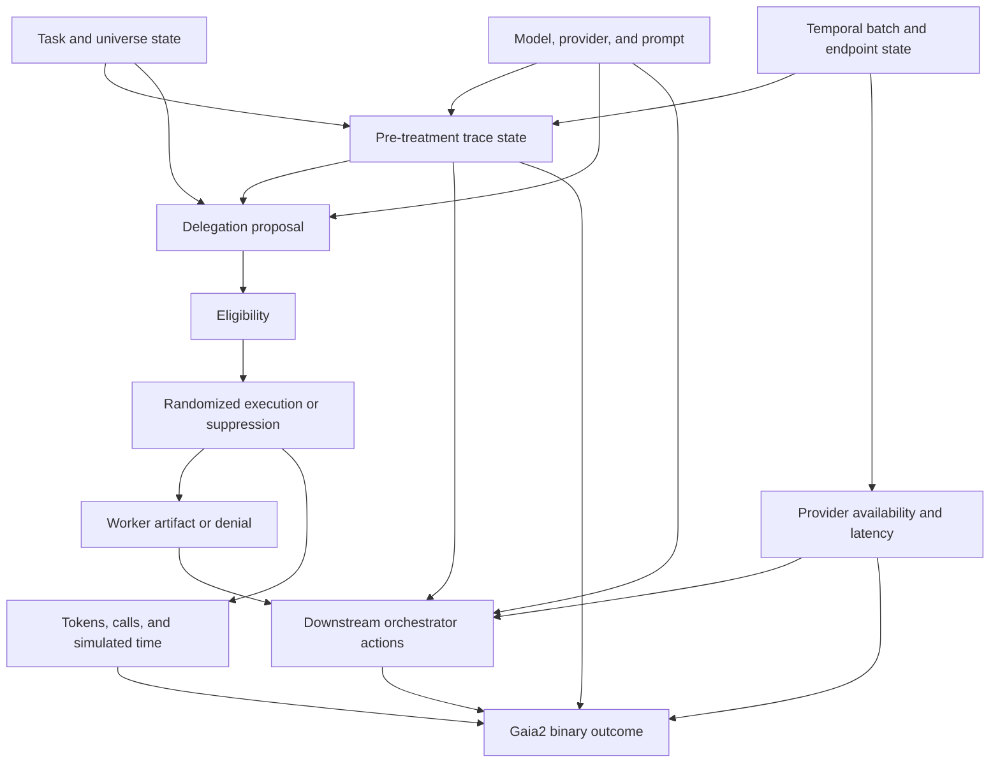

# Causal Analysis of Dynamic LLM-Agent Orchestration in Meta ARE and Gaia2

## Source-Audited Experimental Protocol and Implementation Specification

**Protocol ID:** `causal-orch-delegation-v1`  
**Status:** Locked for implementation and pilot, subject only to the explicit pilot gates and amendment rules in this document  
**Date:** July 23, 2026  
**Repository:** `SirNosh/causal-orch`  
**Upstream implementation audited at:** `facebookresearch/meta-agents-research-environments@7946367413129784139e785ae4c351090002a0bb`  
**Primary research program:** Causal analysis and eventual reinforcement learning of dynamic LLM-agent orchestration  
**Initial paper:** The causal effect of model-proposed delegation  
**Environment:** Meta Agents Research Environments (ARE)  
**Benchmark:** Gaia2 validation scenarios  
**Model policy:** Exact zero-price text models accessed through OpenRouter only  
**Default primary-model candidate:** `openai/gpt-oss-20b:free`  
**Prespecified alternative/replication candidates:** `nvidia/nemotron-3-super-120b-a12b:free`, then `google/gemma-4-26b-a4b-it:free`

---

# 1. Locked Research Question

The first paper answers one narrow question:

> **Among states in which a dynamic LLM orchestrator proposes delegating a valid bounded subtask, what is the causal effect of executing that exact delegation rather than suppressing it?**

The intervention occurs after the model has revealed its intended action and before that action changes the environment or agent state.

```text
LLM emits a DELEGATE proposal
              ↓
parse and validate proposal
              ↓
record immutable pre-treatment state
              ↓
concealed 50/50 random assignment
              ↓
    ┌─────────┴─────────┐
    ↓                   ↓
execute worker      suppress worker
    ↓                   ↓
worker artifact     fixed denial
    └─────────┬─────────┘
              ↓
continue the same orchestration policy
              ↓
Gaia2 outcome and resource measurements
```

The primary treatment is not “multi-agent versus single-agent” in the abstract. It is:

```text
T = 1: execute the exact first eligible delegation proposed by the current policy
T = 0: suppress that exact proposal and allow the same policy to continue directly
```

This identifies the value of delegation in states where the current policy actually wanted to delegate.

---

# 2. Major Source-Audit Conclusion

The original design proposed matched treatment and control continuations from an exact mid-run prefix. After auditing the current ARE repository, that design is **not locked as the primary experiment**.

ARE provides:

- serializable application state through `App.get_state()`;
- application restoration through `App.load_state()`;
- scenario reset to initial app state through `Scenario.soft_reset()`;
- agent-log reload through `BaseAgent.replay()`;
- action replay through `are.simulation.replay.replay_logs()`;
- environment state export through `Environment.get_state()`.

However, ARE does **not** currently expose a public, complete `Environment.load_state()` that restores every live mid-run component. The built-in replay utility re-executes logged application actions. It does not establish exact restoration of all of the following:

- notification message queues;
- environment thread state;
- pause/stop events;
- validator internal state;
- tick counters and timeout counters;
- future event dependency object identity;
- pending system wait state;
- all random-number-generator states;
- action-executor state;
- agent `custom_state`;
- provider-side model state.

Therefore:

> **The locked Paper 1 design is a post-proposal randomized trial, not a paired mid-run fork.**

Exact prefix forking remains an optional engineering extension described in Section 35. It may not be used as the primary analysis unless a custom full-state snapshot/restore implementation passes the exactness gates defined there.

This correction makes the protocol less elegant statistically but substantially more defensible technically.

---

# 3. Source-Verified Feasibility Matrix

The table below separates what ARE supports directly from what this repository must implement.

| Requirement | Upstream status | Implementation decision |
|---|---|---|
| Custom agent inner loop | Supported | Subclass/configure `BaseAgent` |
| Pre/post agent hooks | Supported | Use `ConditionalStep` only for monitoring and invariant checks |
| Custom termination | Supported | Use `TerminationStep` or fixed max iterations |
| Parse action before execution | Supported | Intercept in a custom `JsonActionExecutor` subclass |
| Custom tools | Supported | Add non-environment `return_artifact` and orchestration actions |
| Log callback per agent log | Supported | Preserve native logs and add separate orchestration JSONL |
| Simulated fixed/measured model time | Supported | Wire `env.pause` and `env.resume_with_offset` |
| Application state serialization | Supported per app | Use for state hashes and worker write-guard |
| Scenario reset to initial state | Supported | Use fresh scenario/environment per run; do not reuse live state |
| Full mid-run environment restore | **Not natively supported** | Not required for primary design |
| Native OpenRouter provider pinning | Not exposed by stock ARE engine | Implement custom `OpenRouterLLMEngine` |
| Detailed OpenRouter request metadata | Stock engine returns no metadata | Implement custom engine metadata extraction |
| Read-only cognitive worker | Not a turnkey primitive | Build fresh `BaseAgent` with audited read-only tool subset |
| Worker write prevention | Tool metadata exists but can be unknown | Exact allowlist + `write_operation is False` + state-diff guard |
| Binary Gaia2 success | Supported | Use `Scenario.validate(env)` as primary outcome |
| Partial oracle completion score | Not a standard `ScenarioValidationResult` field | Implement an explicitly labeled exploratory validator-milestone metric |
| Offline judging of traces | Supported | Use stock trace/judge path for binary validation where applicable |
| Agent2Agent application agents | Supported | Excluded from Paper 1 |
| Noise augmentation | Supported | Excluded from Paper 1 |

## 3.1 Relevant upstream code paths

The implementation is based on these source locations at the pinned upstream commit:

- Custom-agent API:  
  `are/simulation/agents/default_agent/base_agent.py`
- ARE lifecycle wrapper:  
  `are/simulation/agents/default_agent/are_simulation_main.py`
- JSON action parser/executor:  
  `are/simulation/agents/default_agent/tools/json_action_executor.py`
- LLM abstraction:  
  `are/simulation/agents/llm/llm_engine.py`
- Stock LiteLLM adapter:  
  `are/simulation/agents/llm/litellm/litellm_engine.py`
- Agent builder injection point:  
  `are/simulation/agents/agent_builder.py`
- Scenario runner:  
  `are/simulation/scenario_runner.py`
- Environment and state export:  
  `are/simulation/environment.py`
- App state and tool metadata:  
  `are/simulation/apps/app.py`, `are/simulation/tool_utils.py`
- Scenario reset and validation:  
  `are/simulation/scenarios/scenario.py`
- Replay utility:  
  `are/simulation/replay.py`
- Agent logs:  
  `are/simulation/agents/agent_log.py`
- Notifications:  
  `are/simulation/notification_system.py`
- Gaia2 evaluation guide:  
  `docs/user_guide/gaia2_evaluation.rst`

Stable source links are collected in Section 47.

---

# 4. Why Delegation Is the Correct First Intervention

Delegation is the foundational multi-agent action. It creates most downstream orchestration mechanisms:

- task decomposition;
- context selection;
- worker creation;
- additional model calls;
- evidence transfer;
- communication overhead;
- integration burden;
- possible correction;
- possible correlated error;
- delay and resource consumption.

A broad architecture comparison would conflate these mechanisms with:

- parallelism;
- persistent thread memory;
- episode compression;
- skill activation;
- worker count;
- model routing;
- verification;
- aggregation;
- stopping.

The first experiment therefore allows only:

```text
one orchestrator
at most one fresh cognitive worker
no worker recursion
no parallel workers
no worker environment writes
no verifier in delegation runs
```

This leaves one primary causal contrast: whether the proposed worker is allowed to run.

---

# 5. Decision on Slate and Onyx

Slate and Onyx are not experimental conditions in Paper 1.

The paper will not compare:

- Onyx-like runtime versus stock ARE;
- Slate thread weaving versus a single ReAct loop;
- persistent worker versus fresh worker;
- thread versus fork execution;
- compressed episode versus selected raw context;
- static versus dynamic skills;
- parallel versus sequential execution.

These are separate treatments.

The only retained principle is:

> A probabilistic model proposes a typed orchestration action, while deterministic runtime code validates, modifies, executes, and logs that action.

That principle is necessary for causal intervention. It is fixed infrastructure, not an Onyx ablation and not a novelty claim.

---

# 6. Primary and Secondary Research Questions

## 6.1 Primary

> Among first eligible delegation proposals, what is the intent-to-treat effect of allowing the delegation on binary Gaia2 success?

## 6.2 Key secondary

1. What is the effect on activated validator-milestone completion?
2. What is the effect on model calls and token usage?
3. What is the effect on simulated time and wall time?
4. Does the worker discover evidence not already present in the orchestrator trace?
5. Does the worker change a consequential downstream environment write?
6. Does the effect differ by Gaia2 capability or delegation reason code?
7. How does the randomized effect differ from the naive observational association?
8. Does the effect replicate across a different free OpenRouter model family?

## 6.3 Deferred

Paper 1 does not estimate:

- the effect of delegation in states where it was never proposed;
- the optimal number of workers;
- the value of recursive delegation;
- the value of persistent memory;
- the causal effect of context compression;
- the optimal stopping policy;
- a complete dynamic orchestration policy;
- a no-regret guarantee for sequential orchestration.

---

# 7. Prespecified Hypotheses

## H1 — Nonzero delegation effect

Executing a valid first delegation proposal changes binary Gaia2 success relative to suppression.

The test is two-sided.

## H2 — Heterogeneous effect

Delegation is more likely to help when the pre-treatment trace contains:

- unresolved information gaps;
- cross-application search;
- explicit uncertainty;
- several candidate records;
- conflicting evidence;
- a separable worker objective.

It is more likely to hurt when:

- the task is nearly complete;
- the objective is poorly isolated;
- the necessary context is omitted;
- the task is tightly sequential;
- the additional simulated delay matters;
- the worker produces misleading evidence.

## H3 — Observational confounding

Delegation proposals are expected to occur more often on difficult traces. Consequently, the observational association between proposing delegation and success may be negative even when the randomized execution effect is positive.

## H4 — Information mechanism

Delegation may first improve evidence coverage, contradiction detection, or planned-action correction before changing terminal success.

## H5 — Model moderation

The causal value of delegation may differ across model families. No direction is prespecified.

---

# 8. Causal Estimand

Let:

- `S` be the full pre-treatment trace state;
- `E=1` indicate that the first valid delegation proposal occurred;
- `T=1` mean delegation was assigned to execute;
- `T=0` mean delegation was assigned to suppression;
- `Y(1)` and `Y(0)` be terminal outcomes.

The primary estimand is:

```math
τ_proposal = E[Y(1) - Y(0) | E = 1]
```

This is a **proposal-conditional intent-to-treat effect**.

It answers:

> When the current policy wants to delegate and produces a valid proposal, what is the effect of making delegation available?

It does not answer:

> Would delegation help in states where the policy did not propose it?

A later encouragement design or alternative proposal policy is required to explore those actions.

---

# 9. Causal Assumptions and Design Enforcement

## 9.1 Consistency

The two interventions must have fixed meanings.

### Treatment semantics

- execute the exact serialized worker specification;
- use the locked worker prompt, model, provider, tool subset, and budgets;
- return the worker artifact or genuine failure;
- disable additional delegation for the remainder of the run.

### Control semantics

- do not instantiate a worker;
- return the exact fixed denial;
- disable additional delegation for the remainder of the run.

```json
{
  "status": "DELEGATION_UNAVAILABLE",
  "reason": "EXPERIMENTAL_CONTROL"
}
```

The denial contains no suggested strategy.

## 9.2 Exchangeability

Treatment is randomized only after:

- the proposal has been parsed;
- eligibility has been determined;
- the proposal has been hashed;
- pre-treatment covariates have been recorded.

## 9.3 Positivity

Every eligible proposal has probability 0.5 of either assignment.

## 9.4 No anticipation

The model cannot observe:

- the assignment;
- the randomization schedule;
- previous assignments;
- treatment probability;
- experimental arm labels.

## 9.5 No interference

Each scenario run uses:

- a fresh scenario instance;
- a fresh environment;
- a fresh orchestrator;
- fresh conversation state;
- no cross-run memory;
- no cross-run artifact cache;
- no model-side persistent session.

## 9.6 Stable measurement

During confirmatory runs, freeze:

- ARE commit;
- Gaia2 revision;
- model and provider;
- prompts;
- tools;
- action schemas;
- randomization code;
- time policy;
- evaluator configuration;
- analysis scripts.

---

# 10. Experimental Randomization

## 10.1 Timing

The first valid `DELEGATE` proposal is the only randomized event in a run.

```text
model response completed
        ↓
DELEGATE action parsed
        ↓
eligibility computed
        ↓
proposal and state logged
        ↓
assignment revealed to runtime
        ↓
treatment/control executed
```

## 10.2 Assignment schedule

Generate a concealed balanced schedule before each batch using a committed seed.

Block by:

- model condition;
- Gaia2 capability;
- scenario ID where repeated runs permit;
- temporal batch.

Recommended approach:

```python
assignment[(model, capability, scenario_id, run_index)] = shuffled_balanced_bit
```

The schedule exists before the run but is not read by the intervention gate until eligibility passes. Runs with no eligible proposal do not consume an assignment for causal analysis, but their hidden scheduled value remains recorded to demonstrate non-anticipation.

## 10.3 One intervention per run

After the first valid proposal is executed or suppressed:

- all later `DELEGATE` proposals return `DELEGATION_ALREADY_DECIDED`;
- no verification intervention is permitted;
- no additional randomized action occurs.

This avoids a sequential-treatment problem in Paper 1.

---

# 11. Agent Architecture

```text
Gaia2 scenario
      ↓
CausalOrchestrator (custom BaseAgent)
      ├── ordinary ARE app tools
      ├── DELEGATE pseudo-action
      ├── send message to user
      ├── wait/system behavior
      └── final answer / termination
                 |
                 | first eligible proposal
                 v
DelegationInterventionGate
      ├── treatment: FreshReadOnlyWorker
      └── control: fixed denial
```

## 11.1 Orchestrator responsibilities

The orchestrator:

- receives user tasks and environment notifications through the normal ARE lifecycle;
- uses ordinary Gaia2 application tools;
- owns all environment writes;
- may propose one bounded delegation;
- integrates the returned artifact;
- continues under the same prompt and policy;
- decides all user-facing messages and final actions.

## 11.2 Worker responsibilities

The worker:

- receives a bounded objective and selected context references;
- can use only audited read-only tools;
- cannot write to any Gaia2 application;
- cannot communicate with the user;
- cannot wait or manipulate environment execution;
- cannot spawn another worker;
- returns one typed artifact;
- terminates after fixed step and token limits.

## 11.3 Homogeneous model condition

Within one experimental model condition:

```text
orchestrator model == worker model
orchestrator provider == worker provider
reasoning configuration identical
sampling configuration identical
```

Prompts and tool permissions differ by role.

---

# 12. Typed Orchestration Action

The model emits one action per step using ARE's existing Thought/Action structure.

Example:

```text
Thought: A separate read-only search can resolve which policy version was active.
Action:
{
  "action": "DELEGATE",
  "action_input": {
    "proposal_id": "uuid",
    "objective": "Determine which policy version governed the transaction date.",
    "reason_code": "TEMPORAL_DEPENDENCY_UNRESOLVED",
    "context_refs": ["task", "transaction_record", "notification_04"],
    "allowed_read_tools": ["EmailClient__search_emails", "FileSystem__read_file"],
    "completion_criterion": "Identify the active version and cite supporting records."
  }
}<end_action>
```

The orchestrator does not choose treatment intensity. Every eligible executed
delegation receives the fixed runtime budget of 8 worker steps and 2,000 worker
output tokens.

## 12.1 Reason codes

```text
INFORMATION_GAP
CROSS_APPLICATION_SEARCH
TEMPORAL_DEPENDENCY_UNRESOLVED
AMBIGUITY_REQUIRES_INDEPENDENT_ANALYSIS
EVIDENCE_CONFLICT
HIGH_WRITE_RISK
CONTEXT_OVERLOAD
SPECIALIZED_CALCULATION
OTHER_BOUNDED_SUBTASK
```

These short visible labels replace any need to store hidden chain-of-thought.

---

# 13. Eligibility Rules

A proposal is eligible only if all checks pass before assignment is revealed.

## 13.1 Schema checks

- `proposal_id` is valid and unique;
- objective is nonempty;
- completion criterion is nonempty;
- reason code belongs to the fixed vocabulary;
- context references resolve to existing trace artifacts;
- requested tools exist in the worker allowlist;
- step and output budgets are within fixed limits.

## 13.2 Scientific checks

- no prior delegation decision occurred;
- objective is bounded;
- objective is not already completed;
- proposal occurs before terminal completion;
- no write capability is requested;
- no oracle reference is included;
- scenario belongs to the prespecified set.

## 13.3 Machine-readable rejection reasons

```text
INVALID_SCHEMA
UNBOUNDED_OBJECTIVE
UNKNOWN_CONTEXT_REFERENCE
WRITE_PERMISSION_REQUESTED
UNAPPROVED_WORKER_TOOL
DUPLICATE_OBJECTIVE
DELEGATION_ALREADY_DECIDED
ORACLE_LEAKAGE_RISK
POST_TERMINAL_PROPOSAL
WORKER_BUDGET_EXCEEDED
SCENARIO_OUT_OF_SCOPE
```

Invalid proposals are logged but not randomized.

---

# 14. Exact ARE Integration Point

The upstream `BaseAgent.step()` performs the following sequence:

1. build model-visible history;
2. call the LLM;
3. append the LLM output log;
4. extract action text;
5. parse the action;
6. execute the parsed action.

The intervention belongs between steps 5 and 6.

## 14.1 Custom executor

Implement:

```python
class InterventionActionExecutor(JsonActionExecutor):
    def __init__(self, *, intervention_gate, tools=None, trace_sink, **kwargs):
        super().__init__(tools=tools, **kwargs)
        self.intervention_gate = intervention_gate
        self.trace_sink = trace_sink

    def execute_parsed_action(
        self,
        parsed_action,
        append_agent_log,
        make_timestamp,
        agent_id,
    ):
        if parsed_action.tool_name == "DELEGATE":
            return self._execute_delegation_action(
                parsed_action,
                append_agent_log,
                make_timestamp,
                agent_id,
            )

        return super().execute_parsed_action(
            parsed_action,
            append_agent_log,
            make_timestamp,
            agent_id,
        )
```

`JsonActionExecutor` should be initialized with tools, not with an LLM engine. The current upstream constructor accepts `tools` and `use_custom_logger`; the LLM engine belongs to `BaseAgent`.

## 14.2 Delegation interception

The custom path must:

1. append the same rationale/tool-call style logs used by ordinary actions;
2. parse `action_input` into `DelegationProposal`;
3. validate eligibility;
4. record the pre-treatment event;
5. reveal assignment;
6. execute worker or denial;
7. append an `ObservationLog` containing only the artifact wrapper or denial;
8. mark the intervention as consumed.

Do not register `DELEGATE` as an ARE application tool. It is an orchestration pseudo-action handled by the custom executor and does not directly mutate a Gaia2 app.

---

# 15. Custom Agent Builder and Runner

The stock `AgentBuilder` exposes only the default agent. `ScenarioRunner` accepts a custom `AbstractAgentBuilder`, so this repository will inject its own builder rather than modifying the ARE event loop.

## 15.1 Builder

```python
class CausalAgentBuilder(AbstractAgentBuilder):
    def __init__(self, experiment_config, trace_sink):
        self.experiment_config = experiment_config
        self.trace_sink = trace_sink

    def list_agents(self) -> list[str]:
        return ["causal_orchestrator"]

    def build(self, agent_config, env=None, mock_responses=None):
        assert env is not None

        llm_engine = OpenRouterLLMEngine(
            config=self.experiment_config.model,
            trace_sink=self.trace_sink,
        )

        gate = DelegationInterventionGate(
            config=self.experiment_config.intervention,
            env=env,
            llm_engine=llm_engine,
            trace_sink=self.trace_sink,
        )

        executor = InterventionActionExecutor(
            intervention_gate=gate,
            trace_sink=self.trace_sink,
        )

        base_agent = CausalOrchestrator(
            llm_engine=llm_engine,
            action_executor=executor,
            log_callback=env.append_to_world_logs,
            max_iterations=self.experiment_config.max_iterations,
            simulated_generation_time_config=self.experiment_config.time_config,
        )

        return ARESimulationAgent(
            log_callback=env.append_to_world_logs,
            pause_env=env.pause,
            resume_env=env.resume_with_offset,
            llm_engine=llm_engine,
            base_agent=base_agent,
            time_manager=env.time_manager,
            max_turns=agent_config.max_turns,
            simulated_generation_time_config=self.experiment_config.time_config,
        )
```

The concrete constructor arguments must follow the pinned upstream code, not stale examples from older docs.

## 15.2 Runner

Use either:

```python
runner = ScenarioRunner(
    agent_config_builder=CausalAgentConfigBuilder(...),
    agent_builder=CausalAgentBuilder(...),
)
```

or a thin `CausalScenarioRunner` wrapper that preserves the stock sequence:

1. construct `EnvironmentConfig`;
2. construct `InstrumentedEnvironment`;
3. initialize the scenario;
4. call `env.run(scenario, wait_for_end=False)`;
5. build the custom ARE agent;
6. call `run_scenario`;
7. call `scenario.validate(env)`;
8. export native and custom traces;
9. stop the environment.

The environment reaction loop in `are_simulation_main.py` is retained.

---

# 16. Scenario Initialization and Isolation

ARE's environment requires an initialized scenario.

For every run:

```python
scenario = load_scenario_from_pinned_dataset(...)
scenario.initialize(...)
env = InstrumentedEnvironment(...)
env.run(scenario, wait_for_end=False)
agent = builder.build(..., env=env)
result = agent.run_scenario(scenario, notification_system=env.notification_system)
validation = scenario.validate(env)
env.stop()
```

Use a **fresh scenario and environment object per run**.

Do not:

- call `soft_reset()` and reuse a live environment across treatment assignments;
- share application objects across runs;
- share event queues;
- share agent logs;
- share worker artifacts.

`Scenario.soft_reset()` is useful for upstream tests and initial-state reuse, but fresh object construction provides cleaner run isolation.

---

# 17. OpenRouter LLM Engine

## 17.1 Why a custom engine is required

The stock ARE LiteLLM engine is insufficient for this experiment because its current implementation:

- does not expose OpenRouter provider-routing controls;
- does not pass arbitrary provider settings through the request;
- discards response metadata and returns `None` metadata;
- therefore causes native token and duration logs to remain zero;
- does not validate returned model identity.

Implement a custom subclass of ARE's `LLMEngine`.

## 17.2 Required interface

```python
class OpenRouterLLMEngine(LLMEngine):
    def __init__(self, config, trace_sink):
        super().__init__(config.model_slug)
        self.config = config
        self.trace_sink = trace_sink
        self.client = httpx.Client(...)

    def chat_completion(
        self,
        messages,
        stop_sequences=None,
        schema=None,
        additional_trace_tags=None,
        **kwargs,
    ) -> tuple[str, dict]:
        ...
```

## 17.3 Request requirements

The request must include:

- exact model slug;
- fixed temperature;
- fixed top-p and other supported sampling parameters;
- fixed maximum completion tokens;
- fixed reasoning configuration where supported;
- provider routing object;
- fallback disabled;
- exact pinned provider where available;
- unique request correlation ID;
- optional OpenRouter attribution headers.

Representative request body:

```json
{
  "model": "openai/gpt-oss-20b:free",
  "messages": [],
  "temperature": 0.2,
  "top_p": 0.9,
  "max_tokens": 4096,
  "provider": {
    "only": ["PINNED_PROVIDER"],
    "allow_fallbacks": false,
    "require_parameters": true
  }
}
```

The exact provider syntax must be integration-tested against the current OpenRouter API before pilot collection.

## 17.4 Returned metadata

Return a metadata dictionary compatible with `BaseAgent` logging:

```python
metadata = {
    "prompt_tokens": prompt_tokens,
    "completion_tokens": completion_tokens,
    "total_tokens": total_tokens,
    "reasoning_tokens": reasoning_tokens,
    "completion_duration": monotonic_duration,
    "request_id": request_id,
    "returned_model": returned_model,
    "provider": provider_if_exposed,
}
```

The standard fields populate ARE's `LLMOutputThoughtActionLog`. Extended fields go to the custom orchestration trace.

## 17.5 Identity enforcement

After every response:

- compare returned model identity to the requested exact slug;
- record provider identity where available;
- reject silent fallback;
- flag any mismatch as a protocol violation;
- do not retry on another model or provider.

## 17.6 Rate-limit handling

Use bounded exponential backoff with jitter. Record:

- response code;
- retry count;
- wait duration;
- request ID;
- whether the failure occurred before or after treatment assignment.

Do not evade free-tier limits through account rotation.

---

# 18. Free-Model Policy

## 18.1 Hard rule

All orchestrator, worker, and optional verifier calls use exact zero-price OpenRouter text models.

The experiment will not use:

- local inference;
- paid endpoints;
- paid fallback;
- `openrouter/free`;
- automatic model substitution;
- mixed models within one condition.

## 18.2 Candidate order

The qualification order is fixed:

1. `openai/gpt-oss-20b:free`
2. `nvidia/nemotron-3-super-120b-a12b:free`
3. `google/gemma-4-26b-a4b-it:free`

The first candidate passing every hard gate becomes primary.

The model is not selected based on the observed treatment effect.

## 18.3 Availability manifest

Immediately before each qualification or confirmatory batch:

1. query OpenRouter's model catalog;
2. verify input and output price are zero;
3. query available providers/endpoints;
4. select and record one provider;
5. disable fallback;
6. save the raw and normalized manifest;
7. hash the manifest.

Required fields:

```text
snapshot_timestamp_utc
requested_model_slug
returned_canonical_slug
context_length
input_price
output_price
supported_parameters
available_providers
selected_provider
provider_context_length
provider_max_output
provider_data_policy
manifest_sha256
```

## 18.4 Mid-study disappearance

If the primary free endpoint disappears:

- do not substitute within the condition;
- freeze collected data;
- check whether the preregistered minimum was reached;
- if not, amend the protocol and restart a new model condition;
- report the infrastructure termination.

---

# 19. Model Qualification Gates

A candidate may enter confirmation only if it meets all hard gates.

| Gate | Threshold |
|---|---:|
| Exact model remains zero-price | Required |
| Provider can be pinned and fallback disabled | Required |
| Returned model identity auditable | Required |
| Request completion excluding declared outages | ≥95% |
| Valid top-level action format | ≥97% after fixed repair policy |
| Valid delegation schema | ≥95% |
| Valid worker artifact schema | ≥95% |
| Valid ordinary tool calls | ≥95% |
| Unauthorized worker writes | 0 |
| Hidden-oracle leakage | 0 |
| Context overflow | <5% |
| Non-Time baseline success | approximately 8%–80% |
| Eligible proposal rate | preferably 20%–70% |

Model selection uses only qualification metrics. Treatment-control differences remain blinded.

---

# 20. Worker Implementation

## 20.1 Fresh session

For treatment, instantiate a new worker `BaseAgent` with:

- the same locked `OpenRouterLLMEngine` configuration;
- a separate agent ID;
- a separate log list;
- a worker-specific system prompt;
- a curated tool dictionary;
- a fixed maximum iteration count;
- a custom `ReturnArtifactTool`.

## 20.2 Worker prompt

The worker prompt states:

- the exact objective;
- the completion criterion;
- selected context;
- permitted tools;
- prohibition on environment modification;
- prohibition on user communication;
- required evidence references;
- required final artifact schema.

## 20.3 Worker completion

Implement a non-environment tool:

```python
class ReturnArtifactTool(Tool):
    name = "return_artifact"
    description = "Return the final structured evidence report and end the worker."
    inputs = {"artifact": {"type": "object", "description": "EvidenceReport"}}

    def forward(self, artifact):
        validated = EvidenceReport.model_validate(artifact)
        return validated.model_dump()
```

The worker terminates when this tool succeeds or when its fixed step/token budget is exhausted.

## 20.4 Artifact schema

```json
{
  "artifact_type": "EVIDENCE_REPORT",
  "objective": "string",
  "status": "COMPLETE | PARTIAL | BLOCKED",
  "findings": [
    {
      "claim": "string",
      "evidence_refs": ["trace_or_tool_reference"],
      "confidence": "LOW | MEDIUM | HIGH"
    }
  ],
  "uncertainties": ["string"],
  "contradictions": ["string"],
  "recommended_next_action": "string or null"
}
```

Every material finding requires an evidence reference.

---

# 21. Enforcing Read-Only Workers

Tool metadata alone is not sufficient because `write_operation` may be `None` for incompletely annotated tools.

Use all three controls.

## 21.1 Metadata rule

A worker tool is eligible only when:

```python
app_tool.write_operation is False
```

Treat `None` as unsafe.

## 21.2 Exact-name allowlist

Generate and manually review an exact allowlist after pinning ARE and Gaia2.

Exclude all tools belonging to:

- `AgentUserInterface`;
- `SystemApp`;
- reminder control;
- environment waiting;
- user communication;
- any app tool with write or unknown metadata.

The worker may request only a subset of the global audited allowlist.

## 21.3 State-diff guard

Before worker execution:

```python
before = canonical_hash(env.get_apps_state())
```

After worker completion:

```python
after = canonical_hash(env.get_apps_state())
assert before == after
```

A mismatch is a protocol violation and treatment failure.

The comparison intentionally focuses on application state. Worker read calls may still create logs and consume model time.

## 21.4 Tool-set manifest

For every model/run configuration, save:

```text
tool public name
app name
function name
write_operation
allowlisted
exclusion reason
description hash
argument-schema hash
```

Abort if an unknown or changed tool appears after protocol freeze.

---

# 22. Worker Time Semantics

The worker runs synchronously from the orchestrator's perspective.

Each worker model generation uses the same ARE simulated-generation-time mechanism as the orchestrator:

- pause the environment before the model call;
- resume with the fixed configured offset after the call;
- allow resulting event ticks and notifications to occur according to ARE semantics.

This means treatment legitimately consumes additional simulated time.

Do not freeze simulated time for the entire worker episode, because that would make the worker unrealistically free in time-sensitive environments.

Primary non-Time scenarios reduce sensitivity to this issue. Reserved Time scenarios test it later.

---

# 23. Simulated Time

ARE supports fixed and measured generation-time modes.

Primary policy:

```text
mode = fixed
orchestrator model call = 5 simulated seconds
worker model call = 5 simulated seconds
```

Actual wall time is recorded separately.

The primary effect includes the worker's simulated-time cost. This is appropriate because the system-level question is whether the information benefit justifies added deliberation.

A later Time robustness analysis compares:

1. fixed generation duration;
2. measured provider duration;
3. optionally capped measured duration.

---

# 24. Native and Custom Logging

## 24.1 Native ARE logs

Preserve:

- `SystemPromptLog`;
- `TaskLog`;
- `LLMInputLog`;
- `LLMOutputThoughtActionLog`;
- `ThoughtLog`;
- `ToolCallLog`;
- `ObservationLog`;
- `SubagentLog` where used;
- `FinalAnswerLog`;
- `ErrorLog`;
- `ActionLog`;
- environment event log.

## 24.2 Separate orchestration trace

Do not add unregistered custom subclasses to `BaseAgentLog` unless upstream serialization maps are also extended.

Instead write a separate append-only JSONL stream with events:

```text
RUN_STARTED
MODEL_MANIFEST_LOCKED
MODEL_REQUEST
MODEL_RESPONSE
ORCHESTRATOR_PROPOSAL
PROPOSAL_VALIDATION
INTERVENTION_ELIGIBILITY
INTERVENTION_ASSIGNMENT
DELEGATION_EXECUTED
DELEGATION_SUPPRESSED
WORKER_STARTED
WORKER_TOOL_CALL
WORKER_TOOL_RESULT
WORKER_ARTIFACT
WORKER_STATE_GUARD
ORCHESTRATOR_RESUMED
PROVIDER_RATE_LIMIT
PROVIDER_OUTAGE
MODEL_IDENTITY_MISMATCH
JUDGE_RESULT
RUN_FAILED
RUN_COMPLETED
```

## 24.3 Common fields

```text
schema_version
experiment_version
scenario_id
universe_id
capability
run_id
attempt_id
event_id
causal_parent_ids
actor_id
actor_role
simulated_timestamp
wall_timestamp
requested_model_slug
returned_model_slug
provider_slug
openrouter_request_id
prompt_hash
tool_schema_hash
state_before_hash
state_after_hash
proposed_action
executed_action
eligibility
eligibility_reason
treatment_assignment
assignment_probability
context_refs
artifact_refs
tool_refs
prompt_tokens
completion_tokens
reasoning_tokens
total_tokens
wall_latency
simulated_duration
retry_count
error_type
protocol_violation
```

---

# 25. Outcomes

## 25.1 Primary outcome

**Binary Gaia2 success** from `Scenario.validate(env)` under the pinned benchmark implementation.

This is the only primary efficacy endpoint.

## 25.2 Key secondary: activated validator-milestone completion

`ScenarioValidationResult` does not expose a built-in partial oracle score. Therefore, the protocol must not call a custom fraction a native Gaia2 metric.

Implement an exploratory metric:

> **Activated validator-milestone completion fraction**

For each `AgentValidationEvent` activated during the run:

1. assign a stable validator ID from scenario event ID and activation index;
2. record the initial number of milestones;
3. observe the number moved into `achieved_milestones`;
4. aggregate across activated validators.

```text
sum(achieved milestones across activated validators)
----------------------------------------------------
sum(initial milestones across activated validators)
```

Also report:

- number of validators activated;
- number never activated;
- triggered minefields;
- validator timeouts.

Because validator activation may itself be post-treatment, this metric is descriptive and secondary. It is not used as a covariate in the primary treatment-effect model.

## 25.3 Task outcomes

- final binary success;
- final environment failure;
- triggered minefield count;
- validator timeout count;
- user clarification correctness where auditable;
- invalid ordinary tool calls;
- unauthorized worker writes.

## 25.4 Resource outcomes

- orchestrator model calls;
- worker model calls;
- input tokens;
- output tokens;
- reasoning tokens where exposed;
- total tokens;
- read-tool calls;
- write-tool calls;
- simulated time;
- wall time;
- rate-limit waits;
- retries;
- provider failures.

The endpoints are zero-price to the experimenter, not computationally costless.

## 25.5 Mechanism outcomes

- artifact validity;
- objective completion;
- unique evidence found;
- duplicate evidence;
- contradiction detected;
- artifact referenced downstream;
- intended action changed;
- invalid write prevented;
- valid write incorrectly prevented;
- error introduced.

Mechanism labels may require manual audit or deterministic evidence-reference comparison.

---

# 26. Instrumented Environment

A thin `InstrumentedEnvironment(Environment)` may be used without changing benchmark semantics.

Responsibilities:

- capture validator activation metadata;
- record state hashes at prespecified points;
- attach run IDs to custom trace events;
- expose audited app-state snapshots;
- preserve the normal `Environment.process_event` result.

Do not modify:

- event readiness;
- event execution;
- validator logic;
- oracle logic;
- notification content;
- scenario duration;
- app behavior.

Example pattern:

```python
class InstrumentedEnvironment(Environment):
    def process_event(self, event):
        if isinstance(event, AgentValidationEvent):
            self.trace_sink.validator_event_seen(event)

        result = super().process_event(event)
        self.trace_sink.capture_validator_state(self.agent_action_validators)
        return result
```

If stable validator-to-event IDs cannot be recovered with this noninvasive wrapper, the partial metric is dropped rather than changing benchmark behavior.

---

# 27. Gaia2 Dataset Use

The pinned upstream documentation states:

- 800 standard scenarios;
- 160 Gaia2-mini scenarios;
- five core capability groups with 32 mini scenarios each;
- 160 Agent2Agent augmentation scenarios;
- 160 Noise augmentation scenarios.

Nevertheless, every run must pin and enumerate the downloaded dataset revision because dataset artifacts can change independently of documentation.

## 27.1 Version lock

Store:

```text
Hugging Face dataset name
revision SHA
split
config
scenario IDs
capability labels
universe IDs
row counts
manifest SHA-256
```

## 27.2 No RL training on validation

Validation scenarios may be used for development, evaluation, and this causal experiment, but not to train the later orchestration policy.

Later training uses custom or procedurally generated ARE scenarios.

---

# 28. Scenario Split

Assuming the official 160-scenario mini split is confirmed:

```text
Pilot:
  8 scenarios × 5 capabilities = 40

Confirmatory non-Time:
  24 scenarios × 4 capabilities = 96

Reserved Time:
  24 scenarios
```

If the pinned dataset differs, preserve the same 25% pilot proportion within each capability and generate an immutable split manifest.

Stratify by:

- capability;
- universe where possible.

Do not inspect confirmatory outcomes before freezing prompts, model, provider, eligibility, and analysis.

---

# 29. Why Time, Agent2Agent, and Noise Are Deferred

## Time

Time tasks make the treatment effect strongly dependent on:

- provider latency;
- free-tier queueing;
- rate limits;
- simulated-time policy;
- additional worker calls.

They are a later robustness setting.

## Agent2Agent

Agent2Agent replaces direct app access with app-agent communication. That is a different hierarchy from cognitive worker delegation and would confound the first experiment.

## Noise

Noise modifies tool reliability and environment behavior. It is a later moderator/generalization condition.

---

# 30. Pilot and Qualification Phases

## Phase 0 — Upstream and dataset lock

- pin ARE commit;
- lock Python environment;
- pin Gaia2 revision;
- generate scenario manifest;
- save tool manifest;
- save model/provider manifest.

## Phase 1 — Infrastructure smoke test

Use 20 scenarios, four per capability, one run each.

Validate:

- scenario initialization;
- environment lifecycle;
- custom builder;
- OpenRouter identity enforcement;
- ordinary tool execution;
- `DELEGATE` parsing;
- treatment concealment;
- worker read-only controls;
- state-diff guard;
- native trace export;
- custom trace export;
- binary judging;
- fixed simulated time.

No scientific conclusions.

## Phase 2 — Model qualification

Evaluate candidates in the fixed order.

Keep treatment-effect contrasts blinded.

## Phase 3 — Pilot

```text
40 pilot scenarios × 3 repeated runs = 120 base runs
```

Estimate:

- baseline success;
- proposal rate;
- eligibility rate;
- endpoint failure rate;
- worker schema validity;
- treatment compliance;
- outcome variance;
- scenario intraclass correlation;
- mean model-call burden;
- minimum detectable effect.

Allowed changes are limited to infrastructure, parsing, prompt clarity, and schema reliability. Pilot results are not confirmatory evidence.

---

# 31. Confirmatory Sample Plan

Start with:

```text
96 non-Time scenarios × 6 runs = 576 runs
```

Extend to:

```text
96 scenarios × 8 runs = 768 runs maximum
```

Stop when either:

- at least 300 eligible randomized proposals have completed, or
- the 768-run cap is reached.

Minimum analyzable eligible proposals:

```text
200
```

The final rule must be updated through pilot-based power simulation before preregistration.

## 31.1 Power simulation inputs

- baseline binary success;
- eligible proposal rate;
- treatment effect scenarios;
- scenario-level correlation;
- endpoint attrition;
- block-randomization structure.

Do not claim power for small effects unless simulations support it.

---

# 32. Statistical Analysis

## 32.1 Primary estimator

Intent-to-treat difference in binary success among eligible proposals.

Report:

- treatment and control counts;
- success proportions;
- absolute risk difference;
- relative risk;
- 95% confidence interval;
- randomization-inference p-value.

## 32.2 Primary inference

Use the actual concealed assignment schedule for randomization inference.

Supporting models:

- logistic GEE with scenario clustering;
- logistic mixed model with scenario random intercept;
- scenario fixed-effect model where estimable.

The randomization-based result remains primary.

## 32.3 Secondary continuous/count outcomes

Use:

- difference in means;
- robust or cluster bootstrap confidence intervals;
- negative-binomial or Poisson models for counts where appropriate;
- log transforms only if prespecified.

## 32.4 Observational-versus-causal comparison

Produce three estimates:

1. naive proposal/no-proposal association;
2. adjusted observational estimate using pre-treatment covariates only;
3. randomized execution/suppression estimate among eligible proposals.

Candidate pre-treatment covariates:

```text
capability
scenario ID
universe ID
model condition
temporal batch
trace depth
context length
tokens consumed before proposal
read calls before proposal
write calls before proposal
prior invalid calls
prior tool errors
pending notifications
simulated time
reason code
worker objective length
requested worker tool count
```

Use cross-fitting for flexible adjusted observational estimators.

## 32.5 Heterogeneity

Exploratory moderators:

- capability;
- reason code;
- trace depth;
- context length;
- prior errors;
- pending events;
- worker tool breadth;
- model family.

Use hierarchical shrinkage. Do not run many uncorrected subgroup tests.

## 32.6 Multiplicity hierarchy

Confirmatory order:

1. binary Gaia2 success;
2. activated validator-milestone fraction;
3. total tokens/model calls;
4. separately launched verification effect.

All mechanism and subgroup analyses are secondary unless explicitly preregistered.

---

# 33. Avoiding Causal-Analysis Errors

## 33.1 Do not adjust for mediators

Do not control the primary outcome model for:

- worker artifact quality;
- post-treatment tool calls;
- post-treatment trace length;
- whether the artifact was cited;
- final token count;
- later plan changes.

These are consequences of treatment.

## 33.2 Do not exclude failed workers

Worker timeout, malformed artifact, poor analysis, and treatment-induced context failure remain part of the treatment effect.

## 33.3 Do not interpret proposal/no-proposal association as causal

Proposal is selected by task difficulty and policy state.

## 33.4 Do not use oracle-derived variables in policy state

The oracle is used only after the run for evaluation.

## 33.5 Do not select models based on desired effects

Model qualification is blinded to treatment differences.

## 33.6 Do not silently substitute providers

A new provider or model is a new condition.

---

# 34. Failures, Missingness, and Attrition

## 34.1 Pre-treatment infrastructure failure

Examples:

- scenario cannot initialize;
- endpoint unavailable before proposal;
- model identity mismatch before assignment;
- logger failure before assignment.

These attempts may be rerun under the same lineage.

## 34.2 Post-assignment failure

Examples:

- worker provider timeout;
- malformed artifact;
- treatment context overflow;
- orchestrator failure after artifact;
- worker state-diff violation.

These are treatment outcomes under intent-to-treat.

## 34.3 Global provider outage

If the locked provider is broadly unavailable:

- pause the batch;
- do not switch provider;
- retain incomplete attempts;
- resume when the exact endpoint returns;
- report downtime.

## 34.4 Flow table

Publish:

```text
runs scheduled
runs started
runs initialized
runs with any delegation proposal
valid eligible proposals
assignments revealed
treatment assigned
control assigned
workers started
workers completed
state-guard violations
runs completed
runs judged
provider failures
protocol violations
final analysis sample
```

---

# 35. Optional Exact Prefix-Fork Extension

This extension is **not part of the locked primary study**.

It may be activated only if this repository implements and validates a full snapshot codec.

## 35.1 State that must be captured

At minimum:

- every app state;
- app RNG states;
- environment event log;
- event queue and dependency graph;
- `events_to_schedule`;
- environment current time;
- time-manager offsets and pause state;
- tick count;
- environment state flags;
- notification queue;
- reminder and system wait state;
- active validator state and counters;
- agent logs;
- agent iteration and planning counters;
- agent `custom_state`;
- action-executor state;
- treatment-gate state;
- tool manifests;
- all harness RNG states.

## 35.2 Validation gate

A restore implementation must pass:

1. serialize → restore → serialize equality;
2. no-op continuation equality with deterministic mock model;
3. action-replay equality;
4. notification timing equality;
5. validator equality;
6. future event scheduling equality;
7. at least 95% exact round-trip success on selected pilot scenarios.

## 35.3 Scientific status

Until those tests pass, ARE's existing replay utilities are treated as debugging aids, not as proof of exact counterfactual forking.

---

# 36. Verification Experiment

Verification is a separate experiment.

Delegation is disabled in verification runs.

## 36.1 Eligibility

- a concrete candidate plan or answer exists;
- the orchestrator explicitly proposes `VERIFY`;
- evidence references exist;
- no previous verification occurred;
- the candidate has not been submitted.

## 36.2 Treatment

```text
T=1: execute one fresh read-only verifier
T=0: return VERIFICATION_UNAVAILABLE
```

## 36.3 Launch gate

Verification becomes confirmatory only when the delegation pilot shows that:

- valid verification proposal frequency is at least roughly 25%;
- candidate errors exist at a measurable rate;
- verifier schema validity is at least 95%;
- oracle leakage is zero;
- false correction can be audited.

Otherwise it is deferred.

---

# 37. Baselines

## 37.1 Stock ARE ReAct baseline

Run the stock ARE agent with the same model/provider on:

- the pilot split;
- a smaller confirmatory subset.

Purpose:

- contextualize task difficulty;
- detect catastrophic degradation from the custom schema;
- provide a conventional reference.

It is not the causal control.

## 37.2 Delegation-disabled policy baseline

Run the custom orchestrator with `DELEGATE` absent from the system prompt on a subset.

This estimates a deployment-level policy contrast and is secondary to the proposal-conditional experiment.

## 37.3 No Onyx baseline

There is no Onyx or Slate baseline in Paper 1.

---

# 38. Replication

After the primary analysis, replicate the strongest prespecified finding using a distinct free model family.

Recommended subset:

```text
48 stratified scenarios × 3 runs = 144 runs
```

Use the next qualified model in the fixed candidate order.

Report:

- proposal rate;
- eligible-state distribution;
- treatment effect direction;
- effect magnitude and uncertainty;
- resource differences.

Do not pool model families without an explicit hierarchical model.

---

# 39. Manual Audit

Audit at least 10% of eligible randomized runs, stratified by:

- treatment success;
- control success;
- treatment failure;
- control failure;
- large token increase;
- worker artifact failure;
- state-diff violation;
- treatment-induced action change;
- soft or ambiguous evaluator rationale;
- provider error.

Review labels:

- objective boundedness;
- context sufficiency;
- evidence validity;
- unique evidence;
- integration correctness;
- consequential action change;
- judge correctness;
- protocol violation.

Reviewers should be blind to the preferred hypothesis where practical.

---

# 40. Reproducibility Package

Release or preserve:

- ARE commit and patch set;
- Python lock file;
- Gaia2 revision and scenario manifest;
- prompts;
- action and artifact schemas;
- tool allowlist;
- custom OpenRouter engine;
- custom agent builder;
- intervention gate;
- randomization schedule generator;
- trace schemas;
- analysis scripts;
- power simulations;
- model/provider manifests;
- preregistration and amendments;
- audit rubric;
- failure taxonomy.

Free endpoint instability means reproducibility must distinguish:

1. code/protocol reproducibility;
2. exact endpoint reproducibility;
3. model-family replication.

---

# 41. Repository Layout

```text
causal-orch/
├── protocol.md
├── pyproject.toml
├── uv.lock
├── configs/
│   ├── experiment.yaml
│   ├── models.yaml
│   ├── providers.yaml
│   ├── randomization.yaml
│   └── gaia2_manifest.json
├── src/causal_orch/
│   ├── agent/
│   │   ├── orchestrator.py
│   │   ├── worker.py
│   │   ├── prompts.py
│   │   ├── schemas.py
│   │   └── action_executor.py
│   ├── models/
│   │   ├── openrouter_engine.py
│   │   ├── manifests.py
│   │   └── health.py
│   ├── runtime/
│   │   ├── intervention.py
│   │   ├── randomization.py
│   │   ├── read_only_tools.py
│   │   ├── state_guard.py
│   │   └── budgets.py
│   ├── runner/
│   │   ├── agent_builder.py
│   │   ├── config_builder.py
│   │   └── scenario_runner.py
│   ├── environment/
│   │   └── instrumented_environment.py
│   ├── tracing/
│   │   ├── events.py
│   │   ├── sink.py
│   │   ├── hashes.py
│   │   └── parquet.py
│   ├── evaluation/
│   │   ├── gaia2.py
│   │   ├── validator_metrics.py
│   │   └── audit.py
│   └── analysis/
│       ├── flow.py
│       ├── randomization_inference.py
│       ├── mixed_models.py
│       ├── observational.py
│       ├── heterogeneity.py
│       └── power.py
├── scripts/
│   ├── pin_upstream.py
│   ├── pin_dataset.py
│   ├── snapshot_openrouter.py
│   ├── build_tool_allowlist.py
│   ├── qualify_models.py
│   ├── run_smoke.py
│   ├── run_pilot.py
│   ├── run_confirmatory.py
│   └── verify_reproducibility.py
├── tests/
│   ├── test_intervention_concealment.py
│   ├── test_worker_read_only.py
│   ├── test_model_identity.py
│   ├── test_randomization_balance.py
│   ├── test_trace_completeness.py
│   └── test_validator_instrumentation.py
└── docs/
    ├── preregistration.md
    ├── data_dictionary.md
    └── audit_rubric.md
```

---

# 42. Required Tests Before Pilot

## 42.1 Intervention tests

- proposal logged before assignment;
- assignment inaccessible to model;
- invalid proposal never consumes treatment;
- first valid proposal consumes exactly one assignment;
- treatment executes exact serialized spec;
- control launches no worker;
- later proposals are disabled.

## 42.2 Worker safety tests

- write tools absent;
- unknown-operation tools absent;
- AUI and System tools absent;
- worker cannot recurse;
- before/after app-state hash matches;
- worker artifact validates;
- worker logs are attributed separately.

## 42.3 Model tests

- exact requested model returned;
- fallback disabled;
- provider pin respected;
- token metadata populated;
- completion duration populated;
- rate-limit events classified;
- no paid endpoint used.

## 42.4 ARE lifecycle tests

- scenario initialized before `env.run`;
- notification loop remains functional;
- fixed simulated time advances correctly;
- native action logs preserved;
- scenario validation unchanged;
- fresh environment per run.

## 42.5 Trace tests

Every eligible run must contain exactly one ordered chain:

```text
ORCHESTRATOR_PROPOSAL
→ PROPOSAL_VALIDATION
→ INTERVENTION_ELIGIBILITY
→ INTERVENTION_ASSIGNMENT
→ DELEGATION_EXECUTED or DELEGATION_SUPPRESSED
→ ORCHESTRATOR_RESUMED
→ JUDGE_RESULT
```

---

# 43. Preregistration Checklist

Before confirmatory collection, freeze and preregister:

- upstream ARE commit;
- Gaia2 revision and split;
- exact model and provider;
- model manifest hash;
- prompts;
- tool manifest;
- action schema;
- worker schema;
- eligibility rules;
- treatment/control semantics;
- assignment schedule generation;
- primary estimand;
- primary outcome;
- secondary outcomes;
- sample-size rule;
- stopping rule;
- attrition rules;
- provider-outage rules;
- statistical analysis;
- multiplicity hierarchy;
- moderator list;
- manual-audit plan;
- replication model order.

Amendments must be timestamped before confirmatory treatment effects are viewed.

---

# 44. Paper Claims Allowed

The paper may claim:

1. a source-audited proposal-to-execution intervention method in ARE;
2. a randomized proposal-conditional causal estimate of delegation;
3. a typed orchestration trace schema;
4. an implementation of a homogeneous read-only cognitive worker;
5. a comparison between observational and randomized effects;
6. evidence about states where delegation helps or harms;
7. replication across zero-price OpenRouter model families;
8. a causal research protocol accessible without paid frontier APIs.

It may not claim:

- universal superiority of multi-agent systems;
- exact counterfactual prefix forking unless Section 35 gates pass;
- native Gaia2 partial oracle scoring;
- effects of unproposed actions;
- effects of threads, forks, skills, memory, or parallelism;
- that Onyx or Slate succeeds or fails;
- no-regret orchestration learning;
- direct generalization to software engineering or production domains.

---

# 45. Relation to Partial Structure Discovery and Causal Bandits

The current experiment uses direct randomization. It does not apply a static causal-bandit theorem to dynamic traces.

Later work can ask:

> What is the smallest reward-relevant causal structure that preserves all plausibly optimal orchestration actions?

Potential later state variables:

```text
capability
trace depth
evidence coverage
uncertainty
pending events
prior failures
context pressure
resource use
worker disagreement
```

Potential actions:

```text
act directly
delegate
verify
retrieve more evidence
request clarification
wait
continue
stop
```

Dynamic orchestration is sequential and action-dependent, so it is closer to a contextual causal bandit, dynamic treatment regime, or causal MDP than a static causal bandit.

Paper 1 supplies the interventional data required to investigate that extension.

---

# 46. Locked Final Setup

> **Pin Meta ARE at commit `7946367413129784139e785ae4c351090002a0bb` and pin an exact Gaia2 validation revision. Implement a custom `OpenRouterLLMEngine`, `CausalAgentBuilder`, `CausalOrchestrator`, and `InterventionActionExecutor` without modifying ARE's environment event loop. Use only exact zero-price OpenRouter text models, qualify candidates in the fixed order `openai/gpt-oss-20b:free`, `nvidia/nemotron-3-super-120b-a12b:free`, and `google/gemma-4-26b-a4b-it:free`, and pin one provider with fallbacks disabled. Give the orchestrator exclusive environment-write authority. Permit at most one fresh homogeneous worker whose tools are both explicitly marked read-only and present in a manually audited exact-name allowlist, and enforce a pre/post application-state hash guard. On the first valid `DELEGATE` proposal, record the proposal and all pre-treatment covariates, then reveal a concealed 50/50 assignment to execute or suppress that exact proposal. Continue the same policy to completion. Use built-in binary Gaia2 validation as the primary outcome. Treat any validator-milestone fraction as a custom exploratory metric, not a native Gaia2 score. Use randomization inference as primary analysis, with scenario-clustered regression as support. Compare randomized effects against observational trace associations. Exclude exact prefix forking, Onyx/Slate features, persistent threads, parallel workers, recursion, verification, stopping, Agent2Agent, and Noise from the primary experiment.**

---

# 47. Pinned Upstream Source References

All source links below point to the audited upstream commit.

## Agent lifecycle and action seam

- `BaseAgent`:  
  <https://github.com/facebookresearch/meta-agents-research-environments/blob/7946367413129784139e785ae4c351090002a0bb/are/simulation/agents/default_agent/base_agent.py>
- Custom-agent documentation:  
  <https://github.com/facebookresearch/meta-agents-research-environments/blob/7946367413129784139e785ae4c351090002a0bb/docs/api_reference/agents.rst>
- ARE lifecycle wrapper:  
  <https://github.com/facebookresearch/meta-agents-research-environments/blob/7946367413129784139e785ae4c351090002a0bb/are/simulation/agents/default_agent/are_simulation_main.py>
- JSON executor:  
  <https://github.com/facebookresearch/meta-agents-research-environments/blob/7946367413129784139e785ae4c351090002a0bb/are/simulation/agents/default_agent/tools/json_action_executor.py>

## Model integration

- LLM abstraction:  
  <https://github.com/facebookresearch/meta-agents-research-environments/blob/7946367413129784139e785ae4c351090002a0bb/are/simulation/agents/llm/llm_engine.py>
- LLM engine builder:  
  <https://github.com/facebookresearch/meta-agents-research-environments/blob/7946367413129784139e785ae4c351090002a0bb/are/simulation/agents/llm/llm_engine_builder.py>
- Stock LiteLLM engine:  
  <https://github.com/facebookresearch/meta-agents-research-environments/blob/7946367413129784139e785ae4c351090002a0bb/are/simulation/agents/llm/litellm/litellm_engine.py>
- LLM configuration docs:  
  <https://github.com/facebookresearch/meta-agents-research-environments/blob/7946367413129784139e785ae4c351090002a0bb/docs/user_guide/llm_configuration.rst>

## Environment, apps, tools, and replay

- Environment:  
  <https://github.com/facebookresearch/meta-agents-research-environments/blob/7946367413129784139e785ae4c351090002a0bb/are/simulation/environment.py>
- App base class:  
  <https://github.com/facebookresearch/meta-agents-research-environments/blob/7946367413129784139e785ae4c351090002a0bb/are/simulation/apps/app.py>
- Tool metadata and adapter:  
  <https://github.com/facebookresearch/meta-agents-research-environments/blob/7946367413129784139e785ae4c351090002a0bb/are/simulation/tool_utils.py>
- App foundations:  
  <https://github.com/facebookresearch/meta-agents-research-environments/blob/7946367413129784139e785ae4c351090002a0bb/docs/foundations/apps.rst>
- Replay utility:  
  <https://github.com/facebookresearch/meta-agents-research-environments/blob/7946367413129784139e785ae4c351090002a0bb/are/simulation/replay.py>
- Notification system:  
  <https://github.com/facebookresearch/meta-agents-research-environments/blob/7946367413129784139e785ae4c351090002a0bb/are/simulation/notification_system.py>

## Runner and evaluation

- Agent builder:  
  <https://github.com/facebookresearch/meta-agents-research-environments/blob/7946367413129784139e785ae4c351090002a0bb/are/simulation/agents/agent_builder.py>
- Scenario runner:  
  <https://github.com/facebookresearch/meta-agents-research-environments/blob/7946367413129784139e785ae4c351090002a0bb/are/simulation/scenario_runner.py>
- Scenario implementation:  
  <https://github.com/facebookresearch/meta-agents-research-environments/blob/7946367413129784139e785ae4c351090002a0bb/are/simulation/scenarios/scenario.py>
- Validation result:  
  <https://github.com/facebookresearch/meta-agents-research-environments/blob/7946367413129784139e785ae4c351090002a0bb/are/simulation/scenarios/validation_result.py>
- Event and validator types:  
  <https://github.com/facebookresearch/meta-agents-research-environments/blob/7946367413129784139e785ae4c351090002a0bb/are/simulation/types.py>
- Gaia2 evaluation guide:  
  <https://github.com/facebookresearch/meta-agents-research-environments/blob/7946367413129784139e785ae4c351090002a0bb/docs/user_guide/gaia2_evaluation.rst>

---

# Appendix A — Pre-Treatment Covariates

```text
scenario_id
universe_id
capability
run_index
randomization_block
model_slug
provider_slug
temporal_batch
trace_step
simulated_time
context_tokens
prompt_tokens_so_far
completion_tokens_so_far
reasoning_tokens_so_far
read_calls_so_far
write_calls_so_far
invalid_calls_so_far
tool_errors_so_far
pending_notifications
processed_notifications
number_of_distinct_apps_read
explicit_uncertainty_flag
delegation_reason_code
worker_objective_length
worker_tool_count
worker_context_ref_count
```

No hidden oracle-derived field may be visible to the model or determine eligibility.

# Appendix B — Pilot Decision Table

| Pilot observation | Decision |
|---|---|
| Baseline success <8% | Promote next qualified free model before confirmation |
| Baseline success >80% | Add harder standard scenarios or rely on binary plus descriptive partial metrics |
| Eligible proposal rate <20% | Broaden scenarios or report limited policy support; do not force proposals |
| Eligible proposal rate >80% | Audit prompt-induced overdelegation |
| Worker artifact validity <95% | Repair worker schema/runtime before confirmation |
| Any worker write | Block confirmation until fixed |
| Provider pinning unavailable | Reject candidate for primary condition |
| Returned model identity cannot be audited | Reject candidate for primary condition |
| Free endpoint disappears before confirmation | Promote next candidate through amendment |
| Free endpoint disappears mid-confirmation | Freeze condition; do not substitute within it |
| Confirmatory target infeasible under rate limits | Extend collection or change model before confirmation |
| Validator instrumentation changes benchmark behavior | Drop custom partial metric |

# Appendix C — Minimum Paper Tables

1. ARE and Gaia2 version manifest.
2. Model/provider manifest.
3. Tool allowlist and write-safety audit.
4. Run flow and attrition.
5. Proposal and eligibility rates.
6. Treatment/control balance.
7. Primary binary-success effect.
8. Validator-milestone descriptive effect.
9. Token, call, and time effects.
10. Observational versus randomized estimates.
11. Heterogeneity.
12. Worker mechanism outcomes.
13. Cross-model replication.
14. Manual audit.
15. Provider failures and protocol violations.

# Appendix D — Recommended Figures

1. ARE integration architecture.
2. Proposal-to-execution intervention seam.
3. Causal DAG.
4. Run-flow diagram.
5. Observational association versus randomized effect.
6. Treatment effects by capability/reason code.
7. Success-resource frontier.
8. Cross-model comparison.
9. Example beneficial delegation trace.
10. Example harmful delegation trace.

# Appendix E — Causal DAG



The primary total-effect analysis does not adjust for `W`, `A`, or `R`.
